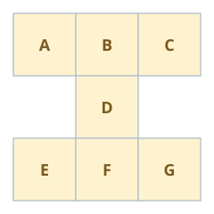

# Maximum Sum of an Hourglass

## Description

You are given an m x n integer matrix grid.

We define an hourglass as a part of the matrix with the following form:



```text
a b c
  d
e f g
```

Return the maximum sum of the elements of an hourglass.

Note that an hourglass cannot be rotated and must be entirely contained
within the matrix.

### Example 1


```text
Input: grid = [[6,2,1,3],[4,2,1,5],[9,2,8,7],[4,1,2,9]]
Output: 30
Explanation: The cells shown above represent the hourglass with the maximum sum: 6 + 2 + 1 + 2 + 9 + 2 + 8 = 30.
```

### Example 2


```text
Input: grid = [[1,2,3],[4,5,6],[7,8,9]]
Output: 35
Explanation: There is only one hourglass in the matrix, with the sum: 1 + 2 + 3 + 5 + 7 + 8 + 9 = 35.
```

### Constraints

- `m == grid.length`
- `n == grid[i].length`
- `3 <= m, n <= 150`
- `0 <= grid[i][j] <= 10⁶`

## Hints

### Hint 1

Each 3x3 submatrix has exactly one hourglass.

### Hint 2

Find the sum of each hourglass in the matrix and return the largest of these values.
