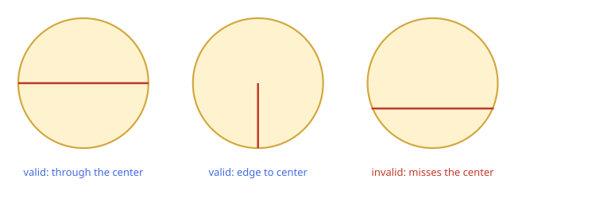
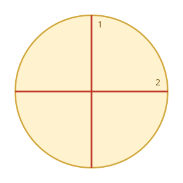

# Minimum Cuts to Divide a Circle

## Description

A valid cut in a circle can be:

- A cut that is represented by a straight line that touches two points on
  the edge of the circle and passes through its center, or
- A cut that is represented by a straight line that touches one point on
  the edge of the circle and its center.



Given the integer `n`, return the minimum number of cuts needed to divide
a circle into `n` equal slices.

### Example 1



```text
Input: n = 4
Output: 2
Explanation: The above figure shows how cutting the circle twice through
the middle divides it into 4 equal slices.
```

### Example 2


```text
Input: n = 3
Output: 3
Explanation: At least 3 cuts are needed to divide the circle into 3 equal
slices. It can be shown that less than 3 cuts cannot result in 3 slices of
equal size and shape. Also note that the first cut will not divide the
circle into distinct parts.
```

### Constraints

- `1 <= n <= 100`

## Hints

### Hint 1

Think about odd and even values separately.

### Hint 2

When will we not have to cut the circle at all?
