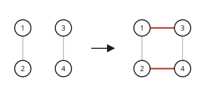
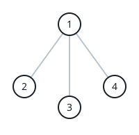

# Add Edges to Make Degrees of All Nodes Even

## Description

There is an undirected graph consisting of n nodes numbered from 1 to n. You
are given the integer n and a 2D array edges where edges[i] = [ai, bi]
indicates that there is an edge between nodes ai and bi. The graph can be
disconnected.

You can add at most two additional edges (possibly none) to this graph so
that there are no repeated edges and no self-loops.

Return true if it is possible to make the degree of each node in the graph
even, otherwise return false.

The degree of a node is the number of edges connected to it.

### Example 1


```text
Input: n = 5, edges = [[1,2],[2,3],[3,4],[4,2],[1,4],[2,5]]
Output: true
Explanation: The above diagram shows a valid way of adding an edge.
Every node in the resulting graph is connected to an even number of edges.
```

### Example 2



```text
Input: n = 4, edges = [[1,2],[3,4]]
Output: true
Explanation: The above diagram shows a valid way of adding two edges.
```

### Example 3



```text
Input: n = 4, edges = [[1,2],[1,3],[1,4]]
Output: false
Explanation: It is not possible to obtain a valid graph with adding at most 2 edges.
```

### Constraints

- `3 <= n <= 10⁵`
- `2 <= edges.length <= 10⁵`
- `edges[i].length == 2`
- `1 <= ai, bi <= n`
- `ai != bi`
- There are no repeated edges.

## Hints

### Hint 1

Notice that each edge that we add changes the degree of exactly 2 nodes.

### Hint 2

The number of nodes with an odd degree in the original graph should be either 0, 2, or 4. Try to work on each of these cases.
