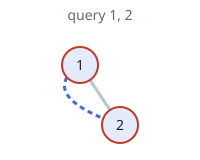

# Cycle Length Queries in a Tree

## Description

You are given an integer n. There is a complete binary tree with 2ⁿ - 1
nodes. The root of that tree is the node with the value 1, and every node
with a value val in the range [1, 2ⁿ⁻¹ - 1] has two children where:

- The left node has the value 2 * val, and
- The right child has the value 2 * val + 1.

You are also given a 2D integer array queries of length m, where
queries[i] = [ai, bi]. For each query, solve the following problem:

- Add an edge between the nodes with values ai and bi.
- Find the length of the cycle in the graph.
- Remove the added edge between nodes with values ai and bi.

Note that:

- A cycle is a path that starts and ends at the same node, and each edge
  in the path is visited only once.
- The length of a cycle is the number of edges visited in the cycle.
- There could be multiple edges between two nodes in the tree after
  adding the edge of the query.

Return an array answer of length m where answer[i] is the answer to the
ith query.

### Example 1


```text
Input: n = 3, queries = [[5,3],[4,7],[2,3]]
Output: [4,5,3]
Explanation: The diagrams above show the tree of 2³ - 1 nodes. Nodes colored in red describe the nodes in the cycle after adding the edge.
- After adding the edge between nodes 3 and 5, the graph contains a cycle of nodes [5,2,1,3]. Thus answer to the first query is 4. We delete the added edge and process the next query.
- After adding the edge between nodes 4 and 7, the graph contains a cycle of nodes [4,2,1,3,7]. Thus answer to the second query is 5. We delete the added edge and process the next query.
- After adding the edge between nodes 2 and 3, the graph contains a cycle of nodes [2,1,3]. Thus answer to the third query is 3. We delete the added edge.
```

### Example 2



```text
Input: n = 2, queries = [[1,2]]
Output: [2]
Explanation: The diagram above shows the tree of 2² - 1 nodes. Nodes colored in red describe the nodes in the cycle after adding the edge.
- After adding the edge between nodes 1 and 2, the graph contains a cycle of nodes [2,1]. Thus answer for the first query is 2. We delete the added edge.
```

### Constraints

- `2 <= n <= 30`
- `m == queries.length`
- `1 <= m <= 10⁵`
- `queries[i].length == 2`
- `1 <= ai, bi <= 2ⁿ - 1`
- `ai != bi`

## Hints

### Hint 1

Find the distance between nodes “a” and “b”.

### Hint 2

distance(a, b) = depth(a) + depth(b) - 2 * depth(LCA(a, b)). Where
depth(a) denotes depth from root to node “a” and LCA(a, b) denotes the
lowest common ancestor of nodes “a” and “b”.

### Hint 3

To find LCA(a, b), iterate over all ancestors of node “a” and check if it
is the ancestor of node “b” too. If so, take the one with maximum depth.
