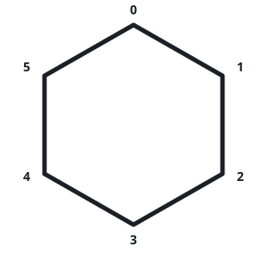

# Count Collisions of Monkeys on a Polygon

## Description

There is a regular convex polygon with n vertices. The vertices are
labeled from 0 to n - 1 in a clockwise direction, and each vertex has
exactly one monkey. The following figure shows a convex polygon of 6
vertices.



Simultaneously, each monkey moves to a neighboring vertex. A collision
happens if at least two monkeys reside on the same vertex after the
movement or intersect on an edge.

Return the number of ways the monkeys can move so that at least one
collision happens. Since the answer may be very large, return it modulo
10⁹ + 7.

### Example 1

```text
Input: n = 3

Output: 6

Explanation:

There are 8 total possible movements.
Two ways such that they collide at some point are:
- Monkey 1 moves in a clockwise direction; monkey 2 moves in an anticlockwise direction; monkey 3 moves in a clockwise direction. Monkeys 1 and 2 collide.
- Monkey 1 moves in an anticlockwise direction; monkey 2 moves in an anticlockwise direction; monkey 3 moves in a clockwise direction. Monkeys 1 and 3 collide.
```

### Example 2

```text
Input: n = 4

Output: 14
```

### Constraints

- `3 <= n <= 10⁹`

## Hints

### Hint 1

Try counting the number of ways in which the monkeys will not collide.
