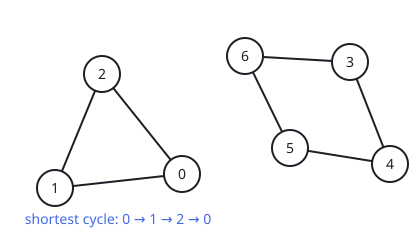
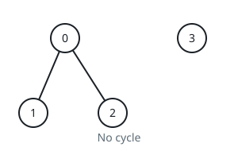

# Shortest Cycle in a Graph

## Description

There is a bi-directional graph with n vertices, where each vertex is labeled
from 0 to n - 1. The edges in the graph are represented by a given 2D integer
array edges, where edges[i] = [ui, vi] denotes an edge between vertex ui and
vertex vi. Every vertex pair is connected by at most one edge, and no vertex
has an edge to itself.

Return the length of the shortest cycle in the graph. If no cycle exists,
return -1.

A cycle is a path that starts and ends at the same node, and each edge in
the path is used only once.

### Example 1



```text
Input: n = 7, edges = [[0,1],[1,2],[2,0],[3,4],[4,5],[5,6],[6,3]]
Output: 3
Explanation: The cycle with the smallest length is : 0 -> 1 -> 2 -> 0
```

### Example 2



```text
Input: n = 4, edges = [[0,1],[0,2]]
Output: -1
Explanation: There are no cycles in this graph.
```

### Constraints

- `2 <= n <= 1000`
- `1 <= edges.length <= 1000`
- `edges[i].length == 2`
- `0 <= ui, vi < n`
- `ui != vi`
- There are no repeated edges.

## Hints

### Hint 1

How can BFS be used?

### Hint 2

For each vertex u, calculate the length of the shortest cycle that contains
vertex u using BFS
