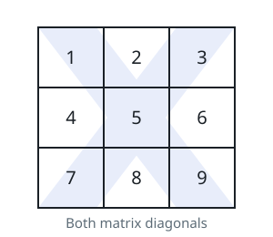

# Prime In Diagonal

## Description

You are given a 0-indexed two-dimensional integer array `nums`.

Return the largest prime number that lies on at least one of the diagonals
of `nums`. In case, no prime is present on any of the diagonals, return 0.

Note that

- An integer is prime if it is greater than 1 and has no positive integer
  divisors other than 1 and itself.
- An integer `val` is on one of the diagonals of `nums` if there exists an
  integer `i` for which `nums[i][i]` = `val` or an `i` for which
  `nums[i][nums.length - i - 1]` = `val`.



### Example 1

```text
Input: nums = [[1,2,3],[5,6,7],[9,10,11]]
Output: 11
Explanation: The numbers 1, 3, 6, 9, and 11 are the only numbers present
on at least one of the diagonals. Since 11 is the largest prime, we return
11.
```

### Example 2

```text
Input: nums = [[1,2,3],[5,17,7],[9,11,10]]
Output: 17
Explanation: The numbers 1, 3, 9, 10, and 17 are all present on at least
one of the diagonals. 17 is the largest prime, so we return 17.
```

### Constraints

- `1 <= nums.length <= 300`
- `nums.length == numsi.length`
- `1 <= nums[i][j] <= 4*10⁶`

## Hints

### Hint 1

Iterate over the diagonals of the matrix and check for each element.

### Hint 2

Check if the element is prime or not in O(sqrt(n)) time.
