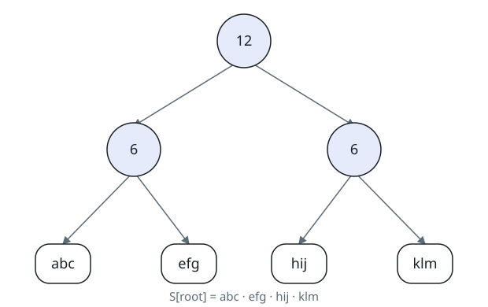
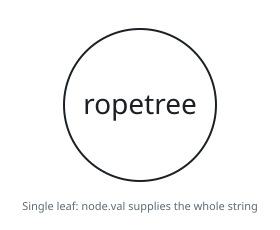

# Extract Kth Character From The Rope Tree

## Description

You are given the root of a binary tree and an integer k. Besides the left
and right children, every node of this tree has two other properties, a
string node.val containing only lowercase English letters (possibly empty)
and a non-negative integer node.len. There are two types of nodes in this
tree:

- Leaf: These nodes have no children, `node.len = 0`, and `node.val` is
  some non-empty string.
- Internal: These nodes have at least one child (also at most two
  children), `node.len > 0`, and `node.val` is an empty string.

The tree described above is called a Rope binary tree. Now we define
S[node] recursively as follows:

- If node is some leaf node, `S[node] = node.val`,
- Otherwise if node is some internal node, `S[node] =
concat(S[node.left], S[node.right])` and `S[node].length = node.len`.

Return k-th character of the string S[root].

Note: If s and p are two strings, concat(s, p) is a string obtained by
concatenating p to s. For example, concat("ab", "zz") = "abzz".

The root is given as its level-order serialization `root`, an array of
strings: the first entry describes the root node, and every internal node
is followed, in order, by entries for its children — up to two, left
first, where an empty entry marks an absent child and trailing absent
children are omitted. An entry of decimal digits stands for an internal
node and carries its `node.len`; an entry of lowercase letters stands for
a leaf node and carries its `node.val`.

### Example 1

```text
Input: root = ["10","4","abcpoe","g","rta"], k = 6
Output: "b"
Explanation: In the picture below, we put an integer on internal nodes that
represents node.len, and a string on leaf nodes that represents node.val.
You can see that S[root] = concat(concat("g", "rta"), "abcpoe") =
"grtaabcpoe". So S[root][5], which represents 6th character of it, is
equal to "b".
```


### Example 2

```text
Input: root = ["12","6","6","abc","efg","hij","klm"], k = 3
Output: "c"
Explanation: In the picture below, we put an integer on internal nodes that
represents node.len, and a string on leaf nodes that represents node.val.
You can see that S[root] = concat(concat("abc", "efg"), concat("hij",
"klm")) = "abcefghijklm". So S[root][2], which represents 3rd character of
it, is equal to "c".
```



### Example 3

```text
Input: root = ["ropetree"], k = 8
Output: "e"
Explanation: In the picture below, we put an integer on internal nodes that
represents node.len, and a string on leaf nodes that represents node.val.
You can see that S[root] = "ropetree". So S[root][7], which represents 8th
character of it, is equal to "e".
```



### Constraints

- The number of nodes in the tree is in the range `[1, 10³]`
- `node.val` contains only lowercase English letters
- `0 <= node.val.length <= 50`
- `0 <= node.len <= 10⁴`
- for leaf nodes, `node.len = 0` and `node.val` is non-empty
- for internal nodes, `node.len > 0` and `node.val` is empty
- `1 <= k <= S[root].length`

## Hints

### Hint 1

Think of recursive methods.

### Hint 2

Write a recursive function that gives a node of the tree and returns
S[node].

### Hint 3

Call the function above on the root of the tree and get k-th character of
it.
