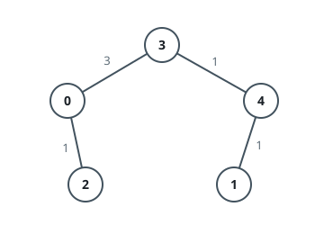
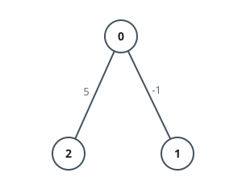
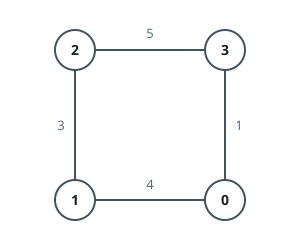

# Modify Graph Edge Weights

## Description

You are given an undirected weighted connected graph containing n nodes labeled
from 0 to n - 1, and an integer array edges where edges[i] = [ai, bi, wi]
indicates that there is an edge between nodes ai and bi with weight wi.

Some edges have a weight of -1 (wi = -1), while others have a positive weight
(wi > 0).

Your task is to modify all edges with a weight of -1 by assigning them positive
integer values in the range [1, 2 * 10⁹] so that the shortest distance between
the nodes source and destination becomes equal to an integer target. If there
are multiple modifications that make the shortest distance between source and
destination equal to target, any of them will be considered correct.

Return an array containing all edges (even unmodified ones) in any order if it
is possible to make the shortest distance from source to destination equal to
target, or an empty array if it's impossible.

Note: You are not allowed to modify the weights of edges with initial positive
weights.

### Example 1



```text
Input: n = 5, edges = [[4,1,-1],[2,0,-1],[0,3,-1],[4,3,-1]], source = 0, destination = 1, target = 5
Output: [[4,1,1],[2,0,1],[0,3,3],[4,3,1]]
Explanation: The graph above shows a possible modification to the edges,
making the distance from 0 to 1 equal to 5.
```

### Example 2



```text
Input: n = 3, edges = [[0,1,-1],[0,2,5]], source = 0, destination = 2, target = 6
Output: []
Explanation: The graph above contains the initial edges. It is not possible to
make the distance from 0 to 2 equal to 6 by modifying the edge with weight -1.
So, an empty array is returned.
```

### Example 3



```text
Input: n = 4, edges = [[1,0,4],[1,2,3],[2,3,5],[0,3,-1]], source = 0, destination = 2, target = 6
Output: [[1,0,4],[1,2,3],[2,3,5],[0,3,1]]
Explanation: The graph above shows a modified graph having the shortest
distance from 0 to 2 as 6.
```

### Constraints

- `1 <= n <= 100`
- `1 <= edges.length <= n * (n - 1) / 2`
- `edges[i].length == 3`
- `0 <= ai, bi < n`
- `wi = -1 or 1 <= wi <= 10⁷`
- `ai != bi`
- `0 <= source, destination < n`
- `source != destination`
- `1 <= target <= 10⁹`
- The graph is connected, and there are no self-loops or repeated edges

## Hints

### Hint 1

Firstly, check that it’s actually possible to make the shortest path from
source to destination equal to the target.

### Hint 2

If the shortest path from source to destination without the edges to be
modified, is less than the target, then it is not possible.

### Hint 3

If the shortest path from source to destination including the edges to be
modified and assigning them a temporary weight of 1, is greater than the
target, then it is also not possible.

### Hint 4

Suppose we can find a modifiable edge (u, v) such that the length of the
shortest path from source to u (dis1) plus the length of the shortest path from
v to destination (dis2) is less than target (dis1 + dis2 < target), then we can
change its weight to “target - dis1 - dis2”.

### Hint 5

For all the other edges that still have the weight “-1”, change the weights
into sufficient large number (target, target + 1 or 200000000 etc.).
