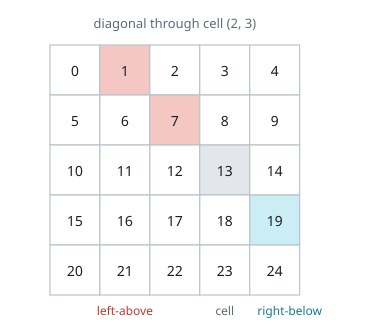

# Difference of Number of Distinct Values on Diagonals

## Description

Given a 2D grid of size m x n, you should find the matrix answer of size
m x n.

The cell answer[r][c] is calculated by looking at the diagonal values of
the cell grid[r][c]:

- Let leftAbove[r][c] be the number of distinct values on the diagonal to
  the left and above the cell grid[r][c] not including the cell grid[r][c]
  itself.
- Let rightBelow[r][c] be the number of distinct values on the diagonal to
  the right and below the cell grid[r][c], not including the cell grid[r][c]
  itself.
- Then answer[r][c] = |leftAbove[r][c] - rightBelow[r][c]|.

A matrix diagonal is a diagonal line of cells starting from some cell in
either the topmost row or leftmost column and going in the bottom-right
direction until the end of the matrix is reached.

- For example, in the below diagram the diagonal is highlighted using the
  cell with indices (2, 3) colored gray:
    - Red-colored cells are left and above the cell.
    - Blue-colored cells are right and below the cell.



Return the matrix answer.

### Example 1

```text
Input: grid = [[1,2,3],[3,1,5],[3,2,1]]
Output: [[1,1,0],[1,0,1],[0,1,1]]
Explanation: To calculate the answer cells:
  answer [0][0]: left-above elements [], leftAbove 0, right-below elements
    [grid[1][1], grid[2][2]], rightBelow |{1, 1}| = 1,
    |leftAbove - rightBelow| = 1
  answer [0][1]: left-above elements [], leftAbove 0, right-below elements
    [grid[1][2]], rightBelow |{5}| = 1, |leftAbove - rightBelow| = 1
  answer [0][2]: left-above elements [], leftAbove 0, right-below elements
    [], rightBelow 0, |leftAbove - rightBelow| = 0
  answer [1][0]: left-above elements [], leftAbove 0, right-below elements
    [grid[2][1]], rightBelow |{2}| = 1, |leftAbove - rightBelow| = 1
  answer [1][1]: left-above elements [grid[0][0]], leftAbove |{1}| = 1,
    right-below elements [grid[2][2]], rightBelow |{1}| = 1,
    |leftAbove - rightBelow| = 0
  answer [1][2]: left-above elements [grid[0][1]], leftAbove |{2}| = 1,
    right-below elements [], rightBelow 0, |leftAbove - rightBelow| = 1
  answer [2][0]: left-above elements [], leftAbove 0, right-below elements
    [], rightBelow 0, |leftAbove - rightBelow| = 0
  answer [2][1]: left-above elements [grid[1][0]], leftAbove |{3}| = 1,
    right-below elements [], rightBelow 0, |leftAbove - rightBelow| = 1
  answer [2][2]: left-above elements [grid[0][0], grid[1][1]],
    leftAbove |{1, 1}| = 1, right-below elements [], rightBelow 0,
    |leftAbove - rightBelow| = 1
```

### Example 2

```text
Input: grid = [[1]]
Output: [[0]]
```

### Constraints

- `m == grid.length`
- `n == grid[i].length`
- `1 <= m, n, grid[i][j] <= 50`

## Hints

### Hint 1

Use the set to count the number of distinct elements on diagonals.
