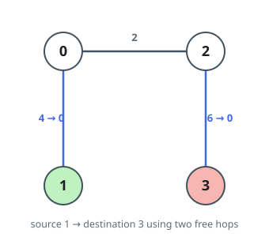

# Find Shortest Path with K Hops

## Description

You are given a positive integer `n` which is the number of nodes of a
0-indexed undirected weighted connected graph and a 0-indexed 2D array
`edges` where `edges[i] = [ui, vi, wi]` indicates that there is an edge
between nodes `ui` and `vi` with weight `wi`.

You are also given two nodes `s` and `d`, and a positive integer `k`, your
task is to find the shortest path from `s` to `d`, but you can hop over at
most `k` edges. In other words, make the weight of at most `k` edges 0 and
then find the shortest path from `s` to `d`.

Return the length of the shortest path from `s` to `d` with the given
condition.

### Example 1



```text
Input: n = 4, edges = [[0,1,4],[0,2,2],[2,3,6]], s = 1, d = 3, k = 2
Output: 2
Explanation: In this example there is only one path from node 1 (the green node) to node 3 (the red node), which is (1->0->2->3) and the length of it is 4 + 2 + 6 = 12. Now we can make weight of two edges 0, we make weight of the blue edges 0, then we have 0 + 2 + 0 = 2. It can be shown that 2 is the minimum length of a path we can achieve with the given condition.
```

### Example 2


```text
Input: n = 7, edges = [[3,1,9],[3,2,4],[4,0,9],[0,5,6],[3,6,2],[6,0,4],[1,2,4]], s = 4, d = 1, k = 2
Output: 6
Explanation: In this example there are 2 paths from node 4 (the green node) to node 1 (the red node), which are (4->0->6->3->2->1) and (4->0->6->3->1). The first one has the length 9 + 4 + 2 + 4 + 4 = 23, and the second one has the length 9 + 4 + 2 + 9 = 24. Now if we make weight of the blue edges 0, we get the shortest path with the length 0 + 4 + 2 + 0 = 6. It can be shown that 6 is the minimum length of a path we can achieve with the given condition.
```

### Example 3


```text
Input: n = 5, edges = [[0,4,2],[0,1,3],[0,2,1],[2,1,4],[1,3,4],[3,4,7]], s = 2, d = 3, k = 1
Output: 3
Explanation: In this example there are 4 paths from node 2 (the green node) to node 3 (the red node), which are (2->1->3), (2->0->1->3), (2->1->0->4->3) and (2->0->4->3). The first two have the length 4 + 4 = 1 + 3 + 4 = 8, the third one has the length 4 + 3 + 2 + 7 = 16 and the last one has the length 1 + 2 + 7 = 10. Now if we make weight of the blue edge 0, we get the shortest path with the length 1 + 2 + 0 = 3. It can be shown that 3 is the minimum length of a path we can achieve with the given condition.
```

### Constraints

- `2 <= n <= 500`
- `n - 1 <= edges.length <= min(10⁴, n * (n - 1) / 2)`
- `edges[i].length = 3`
- `0 <= edges[i][0], edges[i][1] <= n - 1`
- `1 <= edges[i][2] <= 10⁶`
- `0 <= s, d, k <= n - 1`
- `s != d`
- The input is generated such that the graph is connected and has no
  repeated edges or self-loops

## Hints

### Hint 1

Let's construct a new graph and run Dijkstra on it to get the answer to the
problem.

### Hint 2

We define the new graph as follows: Each node of this graph is a pair (v, c)
where v is a node from the given graph and c is any number between 0 and k
(inclusive).

### Hint 3

Try to make edges of the defined graph in such a way that if we run Dijkstra
on the node (s, 0), then the shortest path to node (d, k) would be the final
answer.

### Hint 4

Edge type one: If the edge (v, u, w) belongs to the initial graph, we put an
edge with the weight of w between nodes (v, c) and (u, c) for any c between
0 and k (inclusive) in the new graph.

### Hint 5

Edge type two: If the edge (v, u, w) belongs to the initial graph, we put an
edge with the weight of 0 between nodes (v, c) and (u, c + 1), also between
(u, c) and (v, c + 1) for any c between 0 and k - 1 (inclusive) in the new
graph.

### Hint 6

For the matter of time complexity, note that you **don’t need** to literally
construct the described graph.
