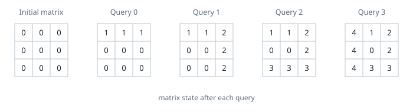
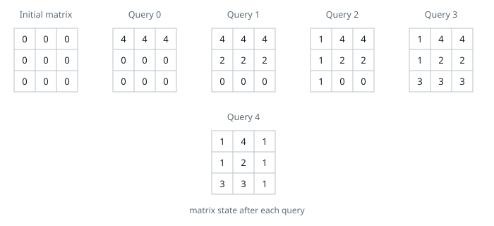

# Sum of Matrix After Queries

## Description

You are given an integer n and a 0-indexed 2D array queries where
queries[i] = [typei, indexi, vali].

Initially, there is a 0-indexed n x n matrix filled with 0's. For each
query, you must apply one of the following changes:

- if typei == 0, set the values in the row with indexi to vali,
  overwriting any previous values.
- if typei == 1, set the values in the column with indexi to vali,
  overwriting any previous values.

Return the sum of integers in the matrix after all queries are applied.

### Example 1



```text
Input: n = 3, queries = [[0,0,1],[1,2,2],[0,2,3],[1,0,4]]
Output: 23
Explanation: The image above describes the matrix after each query. The sum of the matrix after all queries are applied is 23.
```

### Example 2



```text
Input: n = 3, queries = [[0,0,4],[0,1,2],[1,0,1],[0,2,3],[1,2,1]]
Output: 17
Explanation: The image above describes the matrix after each query. The sum of the matrix after all queries are applied is 17.
```

### Constraints

- `1 <= n <= 10⁴`
- `1 <= queries.length <= 5 * 10⁴`
- `queries[i].length == 3`
- `0 <= typei <= 1`
- `0 <= indexi < n`
- `0 <= vali <= 10⁵`

## Hints

### Hint 1

Process queries in reversed order, as the latest queries represent the
most recent changes in the matrix.

### Hint 2

Once you encounter an operation on some row/column, no further operations
will affect the values in this row/column. Keep track of seen rows and
columns with a set.

### Hint 3

When operating on an unseen row/column, the number of affected cells is
the number of columns/rows you haven’t previously seen.
