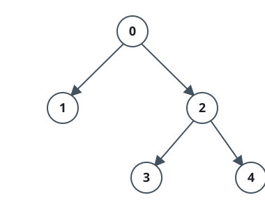

# Is Array a Preorder of Some Binary Tree

## Description

Given a 0-indexed integer 2D array `nodes`, your task is to determine if the
given array represents the preorder traversal of some binary tree.

For each index `i`, `nodes[i] = [id, parentId]`, where `id` is the id of the
node at the index `i` and `parentId` is the id of its parent in the tree (if
the node has no parent, then `parentId == -1`).

Return `true` if the given array represents the preorder traversal of some
tree, and `false` otherwise.

Note: the preorder traversal of a tree is a recursive way to traverse a tree
in which we first visit the current node, then we do the preorder traversal
for the left child, and finally, we do it for the right child.

### Example 1



```text
Input: nodes = [[0,-1],[1,0],[2,0],[3,2],[4,2]]
Output: true
Explanation: The given nodes make the tree in the picture below.
We can show that this is the preorder traversal of the tree, first we visit node 0, then we do the preorder traversal of the right child which is [1], then we do the preorder traversal of the left child which is [2,3,4].
```

### Example 2


```text
Input: nodes = [[0,-1],[1,0],[2,0],[3,1],[4,1]]
Output: false
Explanation: The given nodes make the tree in the picture below.
For the preorder traversal, first we visit node 0, then we do the preorder traversal of the right child which is [1,3,4], but we can see that in the given order, 2 comes between 1 and 3, so, it's not the preorder traversal of the tree.
```

### Constraints

- `1 <= nodes.length <= 10⁵`
- `nodes[i].length == 2`
- `0 <= nodes[i][0] <= 10⁵`
- `-1 <= nodes[i][1] <= 10⁵`
- The input is generated such that `nodes` make a binary tree.

## Hints

### Hint 1

Think of using the stack data structure.

### Hint 2

Put the first node in the stack.

### Hint 3

Iterate over the array and check if the node at the top of the stack is its parent; if it’s not, then pop the last element of the stack and check until you reach the parent of the current node in the array.

### Hint 4

If the stack gets empty at any point, then the array is not the preorder.
