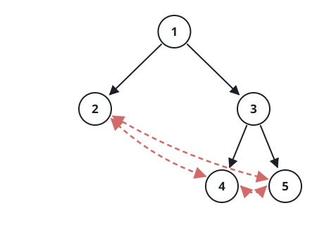

# Height of Special Binary Tree

## Description

The `root` of a special binary tree with `n` nodes is given. Every node
holds a unique value from `1` to `n`. Suppose the tree has `k` leaves,
ordered by value as `b1 < b2 < ... < bk`. The leaves are wired into a
ring:

- the right child of `bi` is `bi+1` when `i < k`, and `b1` otherwise;
- the left child of `bi` is `bi-1` when `i > 1`, and `bk` otherwise.

So every leaf ends up with two children — the leaves that sit just before
and just after it in value order — and a tree with a single leaf has that
leaf as its own left and right child. Every other node's two children are
its ordinary binary-tree children.

Return the height of the tree: the length of the longest path, in edges,
from the root to any other node.

The input carries the ordinary binary tree in level order (see the
examples); the leaf ring follows from the property above and is wired
into place before the call.

### Example 1



```text
Input: root = [1,2,3,null,null,4,5]
Output: 2
Explanation: The leaves, in value order, are 2, 4, and 5, and the ring
wires each leaf's left child to the leaf before it and its right child to
the leaf after it (dashed edges). The longest path runs 1 → 3 → 4 or
1 → 3 → 5 — two edges.
```

### Example 2


```text
Input: root = [1,2]
Output: 1
Explanation: The single leaf 2 is its own left and right child. The only
path away from the root is 1 → 2 — one edge.
```

### Example 3


```text
Input: root = [1,2,3,null,null,4,null,5,6]
Output: 3
Explanation: The leaves 2, 5, and 6 close into a ring in value order.
The longest path runs 1 → 3 → 4 → 5 or 1 → 3 → 4 → 6 — three edges.
```

### Constraints

- The number of nodes is in the range `[2, 10⁴]`.
- `1 <= Node.val <= n`
- All node values are unique.

## Hints

### Hint 1

Trust the child pointers blindly and the walk never ends: from a leaf,
`left` and `right` lead sideways to other leaves. The whole problem is
telling leaves apart from internal nodes before stepping anywhere.

### Hint 2

The wiring itself marks the leaves. A leaf's left child is the previous
leaf in the ring — and that leaf's right child points straight back. So a
node `v` whose left child exists is a leaf exactly when `v.left.right` is
`v` again; for an internal node, `v.left` is a genuine child, and a
child's own right child is never its parent.

### Hint 3

With the leaf test in hand, measure the height the usual way: a leaf
stands at height 0, and any other node stands one above its taller child.
