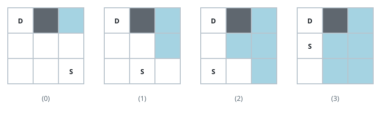

# Minimum Time Takes to Reach Destination Without Drowning

## Description

You are given an `n * m` 0-indexed grid of string land. Right now, you are
standing at the cell that contains `"S"`, and you want to get to the cell
containing `"D"`. There are three other types of cells in this land:

- `"."`: These cells are empty.
- `"X"`: These cells are stone.
- `"*"`: These cells are flooded.

At each second, you can move to a cell that shares a side with your current
cell (if it exists). Also, at each second, every empty cell that shares a
side with a flooded cell becomes flooded as well.

There are two problems ahead of your journey:

- You can't step on stone cells.
- You can't step on flooded cells since you will drown (also, you can't step
  on a cell that will be flooded at the same time as you step on it).

Return the minimum time it takes you to reach the destination in seconds, or
`-1` if it is impossible.

Note that the destination will never be flooded.

### Example 1


```text
Input: land = [["D",".","*"],
               [".",".","."],
               [".","S","."]]
Output: 3
Explanation: The picture below shows the simulation of the land second by
second. The blue cells are flooded, and the gray cells are stone.
Picture (0) shows the initial state and picture (3) shows the final state
when we reach destination. As you see, it takes us 3 second to reach
destination and the answer would be 3.
It can be shown that 3 is the minimum time needed to reach from S to D.
```

### Example 2



```text
Input: land = [["D","X","*"],
               [".",".","."],
               [".",".","S"]]
Output: -1
Explanation: The picture below shows the simulation of the land second by
second. The blue cells are flooded, and the gray cells are stone.
Picture (0) shows the initial state. As you see, no matter which paths we
choose, we will drown at the 3rd second. Also the minimum path takes us
4 seconds to reach from S to D.
So the answer would be -1.
```

### Example 3

```text
Input: land = [["D",".",".",".","*","."],
               [".","X",".","X",".","."],
               [".",".",".",".","S","."]]
Output: 6
Explanation: It can be shown that we can reach destination in 6 seconds.
Also it can be shown that 6 is the minimum seconds one need to reach from
S to D.
```

### Constraints

- `2 <= n, m <= 100`
- land consists only of `"S"`, `"D"`, `"."`, `"*"` and `"X"`.
- Exactly one of the cells is equal to `"S"`.
- Exactly one of the cells is equal to `"D"`.

## Hints

### Hint 1

Think of using breadth-first search.

### Hint 2

Use a BFS to find for each cell the time at which it will become flooded.

### Hint 3

Another BFS then simulates your movement, taking into account information
gathered by the first BFS.
