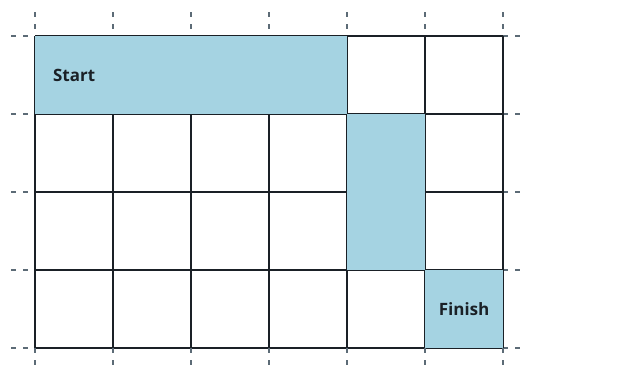

# Determine if a Cell Is Reachable at a Given Time

## Description

You are given four integers sx, sy, fx, fy, and a non-negative integer
t.

In an infinite 2D grid, you start at the cell (sx, sy). Each second,
you must move to any of its adjacent cells.

Return true if you can reach cell (fx, fy) after exactly t seconds, or
false otherwise.

A cell's adjacent cells are the 8 cells around it that share at least
one corner with it. You can visit the same cell several times.

### Example 1



```text
Input: sx = 2, sy = 4, fx = 7, fy = 7, t = 6
Output: true
Explanation: Starting at cell (2, 4), we can reach cell (7, 7) in exactly 6 seconds by going through the cells depicted in the picture above.
```

### Example 2


```text
Input: sx = 3, sy = 1, fx = 7, fy = 3, t = 3
Output: false
Explanation: Starting at cell (3, 1), it takes at least 4 seconds to reach cell (7, 3) by going through the cells depicted in the picture above. Hence, we cannot reach cell (7, 3) at the third second.
```

### Constraints

- `1 <= sx, sy, fx, fy <= 10⁹`
- `0 <= t <= 10⁹`

## Hints

### Hint 1

Minimum time to reach the cell should be less than or equal to given
time.

### Hint 2

The answer is true if t is greater or equal than the Chebyshev distance
from (sx, sy) to (fx, fy). However, there is one more edge case to be
considered.

### Hint 3

The answer is false If sx == fx and sy == fy
