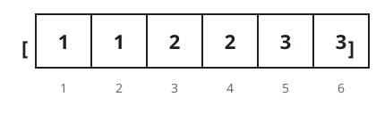

# Minimum Array Length After Pair Removals

## Description

Given an integer array num sorted in non-decreasing order.

You can perform the following operation any number of times:

- Choose two indices, i and j, where nums[i] < nums[j].
- Then, remove the elements at indices i and j from nums. The remaining
  elements retain their original order, and the array is re-indexed.

Return the minimum length of nums after applying the operation zero or
more times.

### Example 1


```text
Input: nums = [1,2,3,4]
Output: 0
```

### Example 2



```text
Input: nums = [1,1,2,2,3,3]
Output: 0
```

### Example 3

```text
Input: nums = [1000000000,1000000000]
Output: 2
Explanation: Since both numbers are equal, they cannot be removed.
```

### Example 4


```text
Input: nums = [2,3,4,4,4]
Output: 1
```

### Constraints

- `1 <= nums.length <= 10⁵`
- `1 <= nums[i] <= 10⁹`
- nums is sorted in non-decreasing order.

## Hints

### Hint 1

To minimize the length of the array, we should maximize the number of
operations performed.

### Hint 2

To perform k operations, it is optimal to use the smallest k values and
the largest k values in nums.

### Hint 3

What is the best way to make pairs from the smallest k values and the
largest k values so it is possible to remove all the pairs?

### Hint 4

If we consider the smallest k values and the largest k values as two
separate sorted 0-indexed arrays, a and b, It is optimal to pair a[i]
and b[i]. So, a k is valid if a[i] < b[i] for all i in the range
[0, k - 1].

### Hint 5

The greatest possible valid k can be found using binary search.

### Hint 6

The answer is nums.length - 2 * k.
