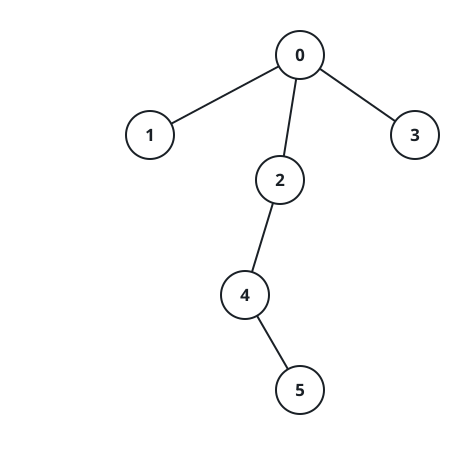
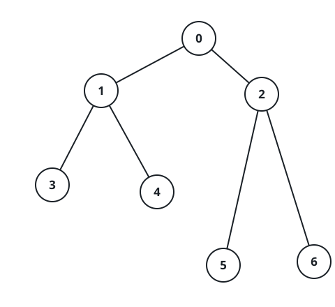

# Maximum Score After Applying Operations on a Tree

## Description

There is an undirected tree with n nodes labeled from 0 to n - 1, and
rooted at node 0. You are given a 2D integer array edges of length n - 1,
where edges[i] = [aᵢ, bᵢ] indicates that there is an edge between nodes
aᵢ and bᵢ in the tree.

You are also given a 0-indexed integer array values of length n, where
values[i] is the value associated with the ith node.

You start with a score of 0. In one operation, you can:

- Pick any node i.
- Add values[i] to your score.
- Set values[i] to 0.

A tree is healthy if the sum of values on the path from the root to any
leaf node is different than zero.

Return the maximum score you can obtain after performing these operations
on the tree any number of times so that it remains healthy.

### Example 1



```text
Input: edges = [[0,1],[0,2],[0,3],[2,4],[4,5]], values = [5,2,5,2,1,1]
Output: 11
Explanation: We can choose nodes 1, 2, 3, 4, and 5. The value of the
root is non-zero. Hence, the sum of values on the path from the root to
any leaf is different than zero. Therefore, the tree is healthy and the
score is values[1] + values[2] + values[3] + values[4] + values[5] = 11.
It can be shown that 11 is the maximum score obtainable after any number
of operations on the tree.
```

### Example 2



```text
Input: edges = [[0,1],[0,2],[1,3],[1,4],[2,5],[2,6]],
values = [20,10,9,7,4,3,5]
Output: 40
Explanation: We can choose nodes 0, 2, 3, and 4.
- The sum of values on the path from 0 to 4 is equal to 10.
- The sum of values on the path from 0 to 3 is equal to 10.
- The sum of values on the path from 0 to 5 is equal to 3.
- The sum of values on the path from 0 to 6 is equal to 5.
Therefore, the tree is healthy and the score is
values[0] + values[2] + values[3] + values[4] = 40.
It can be shown that 40 is the maximum score obtainable after any number
of operations on the tree.
```

### Constraints

- `2 <= n <= 2 * 10⁴`
- `edges.length == n - 1`
- `edges[i].length == 2`
- `0 <= aᵢ, bᵢ < n`
- `values.length == n`
- `1 <= values[i] <= 10⁹`
- The input is generated such that edges represents a valid tree.

## Hints

### Hint 1

Let dp[i] be the maximum score we can get on the subtree rooted at i and
sum[i] be the sum of all the values of the subtree rooted at i.

### Hint 2

If we don't take values[i] into the final score, we can take all the
nodes of the subtrees rooted at i's children.

### Hint 3

If we take values[i] into the score, then each subtree rooted at its
children should satisfy the constraints.

### Hint 4

dp[x] = max(values[x] + sigma(dp[y]), sigma(sum[y])), where y is a direct
child of x.
