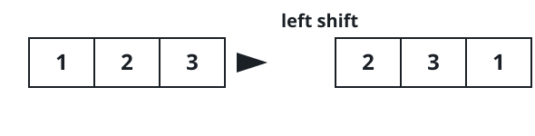
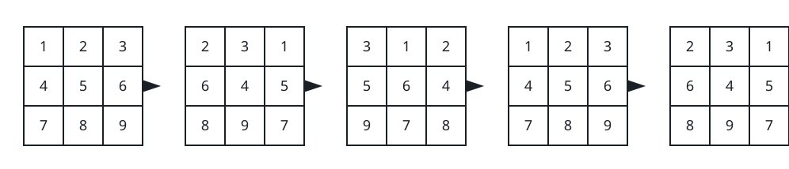

# Matrix Similarity After Cyclic Shifts

## Description

You are given an m x n integer matrix mat and an integer k. The matrix rows
are 0-indexed.

The following proccess happens k times:

- Even-indexed rows (0, 2, 4, ...) are cyclically shifted to the left.
- Odd-indexed rows (1, 3, 5, ...) are cyclically shifted to the right.




Return true if the final modified matrix after k steps is identical to the
original matrix, and false otherwise.

### Example 1



```text
Input: mat = [[1,2,3],[4,5,6],[7,8,9]], k = 4
Output: false
Explanation: In each step left shift is applied to rows 0 and 2 (even
indices), and right shift to row 1 (odd index).
```

### Example 2


```text
Input: mat = [[1,2,1,2],[5,5,5,5],[6,3,6,3]], k = 2
Output: true
```

### Example 3

```text
Input: mat = [[2,2],[2,2]], k = 3
Output: true
Explanation: As all the values are equal in the matrix, even after
performing cyclic shifts the matrix will remain the same.
```

### Constraints

- `1 <= mat.length <= 25`
- `1 <= mat[i].length <= 25`
- `1 <= mat[i][j] <= 25`
- `1 <= k <= 50`

## Hints

### Hint 1

You can reduce k shifts to (k % n) shifts as after n shifts the matrix will
become similar to the initial matrix.
