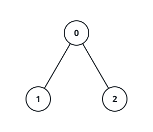

# Find Number of Coins to Place in Tree Nodes

## Description

You are given an undirected tree with `n` nodes labeled from `0` to
`n - 1`, and rooted at node `0`. You are given a 2D integer array
`edges` of length `n - 1`, where `edges[i] = [ai, bi]` indicates that
there is an edge between nodes `ai` and `bi` in the tree.

You are also given a 0-indexed integer array `cost` of length `n`, where
`cost[i]` is the cost assigned to the `i`th node.

You need to place some coins on every node of the tree. The number of
coins to be placed at node `i` can be calculated as:

- If size of the subtree of node `i` is less than 3, place 1 coin.
- Otherwise, place an amount of coins equal to the maximum product of
  cost values assigned to 3 distinct nodes in the subtree of node `i`.
  If this product is negative, place 0 coins.

Return an array `coin` of size `n` such that `coin[i]` is the number of
coins placed at node `i`.

### Example 1


```text
Input: edges = [[0,1],[0,2],[0,3],[0,4],[0,5]], cost = [1,2,3,4,5,6]
Output: [120,1,1,1,1,1]
Explanation: For node 0 place 6 * 5 * 4 = 120 coins. All other nodes are
leaves with subtree of size 1, place 1 coin on each of them.
```

### Example 2


```text
Input: edges = [[0,1],[0,2],[1,3],[1,4],[1,5],[2,6],[2,7],[2,8]], cost =
[1,4,2,3,5,7,8,-4,2]
Output: [280,140,32,1,1,1,1,1,1]
Explanation: The coins placed on each node are:
- Place 8 * 7 * 5 = 280 coins on node 0.
- Place 7 * 5 * 4 = 140 coins on node 1.
- Place 8 * 2 * 2 = 32 coins on node 2.
- All other nodes are leaves with subtree of size 1, place 1 coin on each
  of them.
```

### Example 3



```text
Input: edges = [[0,1],[0,2]], cost = [1,2,-2]
Output: [0,1,1]
Explanation: Node 1 and 2 are leaves with subtree of size 1, place 1 coin
on each of them. For node 0 the only possible product of cost is 2 * 1 *
-2 = -4. Hence place 0 coins on node 0.
```

### Constraints

- `2 <= n <= 2 * 10⁴`
- `edges.length == n - 1`
- `edges[i].length == 2`
- `0 <= ai, bi < n`
- `cost.length == n`
- `1 <= |cost[i]| <= 10⁴`
- The input is generated such that `edges` represents a valid tree.

## Hints

### Hint 1

Use DFS on the whole tree, for each subtree, save the largest three
positive costs and the smallest three non-positive costs. This can be
done by using two Heaps with the size of at most three.

### Hint 2

You need to store at most six values at each subtree.

### Hint 3

If there are more than three values in total, we can sort them. Let's
call the resultant array A, the maximum product of three is
max(A[0] * A[1] * A[n - 1], A[n - 1] * A[n - 2] * A[n - 3]). Don't
forget to set the result to 0 if the value is negative.

### Hint 4

If there are less than three values for a subtree, set its result to 1.
