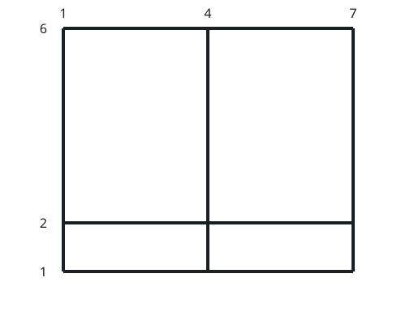

# Maximum Square Area by Removing Fences From a Field

## Description

There is a large `(m - 1) x (n - 1)` rectangular field with corners at
`(1, 1)` and `(m, n)` containing some horizontal and vertical fences
given in arrays `hFences` and `vFences` respectively.

Horizontal fences are from the coordinates `(hFences[i], 1)` to
`(hFences[i], n)` and vertical fences are from the coordinates
`(1, vFences[i])` to `(m, vFences[i])`.

Return the maximum area of a square field that can be formed by removing
some fences (possibly none) or `-1` if it is impossible to make a square
field. Since the answer may be large, return it modulo `10⁹ + 7`.

Note: The field is surrounded by two horizontal fences from the
coordinates `(1, 1)` to `(1, n)` and `(m, 1)` to `(m, n)` and two
vertical fences from the coordinates `(1, 1)` to `(m, 1)` and `(1, n)`
to `(m, n)`. These fences cannot be removed.

### Example 1


```text
Input: m = 4, n = 3, hFences = [2,3], vFences = [2]
Output: 4
Explanation: Removing the horizontal fence at 2 and the vertical fence
at 2 will give a square field of area 4.
```

### Example 2



```text
Input: m = 6, n = 7, hFences = [2], vFences = [4]
Output: -1
Explanation: It can be proved that there is no way to create a square
field by removing fences.
```

### Constraints

- `3 <= m, n <= 10⁹`
- `1 <= hFences.length, vFences.length <= 600`
- `1 < hFences[i] < m`
- `1 < vFences[i] < n`
- `hFences` and `vFences` are unique.

## Hints

### Hint 1

Put 1 and m into hFences. The differences of any two values in the new
hFences can be a horizontal edge of a rectangle.

### Hint 2

Similarly put 1 and n into vFences. The differences of any two values in
the new vFences can be a vertical edge of a rectangle.

### Hint 3

Our goal is to find the maximum common value in both parts.
