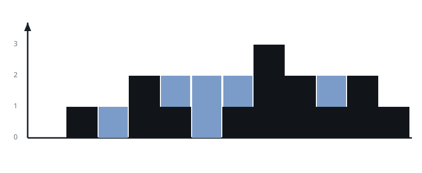

# Calculate Trapping Rain Water

## Description

Table: `Heights`

| Column Name | Type |
| ----------- | ---- |
| id          | int  |
| height      | int  |

`id` is the primary key (column with unique values) for this table, and
it is guaranteed to be in sequential order.

Each row of this table contains an `id` and `height`.

Write a solution to calculate the amount of rainwater can be trapped
between the bars in the landscape, considering that each bar has a width
of 1 unit.

Return the result table in any order.

Each testcase supplies its own `dataset`: the DDL seeds the `Heights`
table with that testcase's rows. The result format is in the following
example.

### Example 1



```text
Input:
Heights table:
+-----+--------+
| id  | height |
+-----+--------+
| 1   | 0      |
| 2   | 1      |
| 3   | 0      |
| 4   | 2      |
| 5   | 1      |
| 6   | 0      |
| 7   | 1      |
| 8   | 3      |
| 9   | 2      |
| 10  | 1      |
| 11  | 2      |
| 12  | 1      |
+-----+--------+
Output:
+---------------------+
| total_trapped_water |
+---------------------+
| 6                   |
+---------------------+
Explanation:
The elevation map is graphically represented with the x-axis denoting
the id and the y-axis representing the heights [0,1,0,2,1,0,1,3,2,1,2,1].
In this scenario, 6 units of rainwater are trapped within the blue
section.
```

Write your solution as a single `SELECT` query returning one column,
`total_trapped_water`, holding exactly one row: the total number of water
units trapped across the whole landscape. Each bar has width 1, so a bar
traps `min(tallest bar to its left, tallest bar to its right) - height`
units when that difference is positive and nothing otherwise, and the
query reports the grand total over all bars. When nothing is trapped
anywhere the single row still appears, carrying 0 — an empty dataset
yields the one row 0 rather than no rows. The judge compares result rows
as an unordered multiset, so with exactly one row there is nothing to
order.
