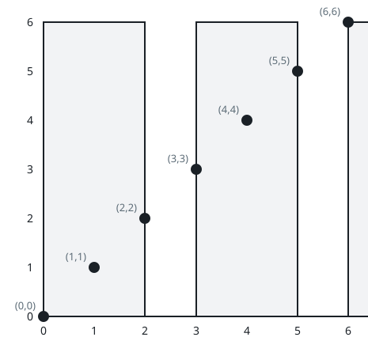

# Minimum Rectangles to Cover Points

## Description

You are given a 2D integer array `points`, where points[i] = [xi, yi].
You are also given an integer w. Your task is to cover all the given
points with rectangles.

Each rectangle has its lower end at some point (x1, 0) and its upper
end at some point (x2, y2), where x1 <= x2, y2 >= 0, and the condition
x2 - x1 <= w must be satisfied for each rectangle.

A point is considered covered by a rectangle if it lies within or on
the boundary of the rectangle.

Return an integer denoting the minimum number of rectangles needed so
that each point is covered by at least one rectangle.

Note: A point may be covered by more than one rectangle.

### Example 1


```text
Input: points = [[2,1],[1,0],[1,4],[1,8],[3,5],[4,6]], w = 1
Output: 2
Explanation: One possible placement of rectangles to cover the points:

	A rectangle with a lower end at (1, 0) and its upper end at (2, 8)
	A rectangle with a lower end at (3, 0) and its upper end at (4, 8)
```

### Example 2



```text
Input: points = [[0,0],[1,1],[2,2],[3,3],[4,4],[5,5],[6,6]], w = 2
Output: 3
Explanation: One possible placement of rectangles to cover the points:

	A rectangle with a lower end at (0, 0) and its upper end at (2, 2)
	A rectangle with a lower end at (3, 0) and its upper end at (5, 5)
	A rectangle with a lower end at (6, 0) and its upper end at (6, 6)
```

### Example 3


```text
Input: points = [[2,3],[1,2]], w = 0
Output: 2
Explanation: One possible placement of rectangles to cover the points:

	A rectangle with a lower end at (1, 0) and its upper end at (1, 2)
	A rectangle with a lower end at (2, 0) and its upper end at (2, 3)
```

### Constraints

- `1 <= points.length <= 10⁵`
- `points[i].length == 2`
- `0 <= xi == points[i][0] <= 10⁹`
- `0 <= yi == points[i][1] <= 10⁹`
- `0 <= w <= 10⁹`
- All pairs (xi, yi) are distinct.

## Hints

### Hint 1

The y values don't matter; only the x values matter.

### Hint 2

Sort all the points by xi.

### Hint 3

Each time, select the smallest x value, x0, from the unselected points,
and then select all the points with x values not larger than x0 + w.
