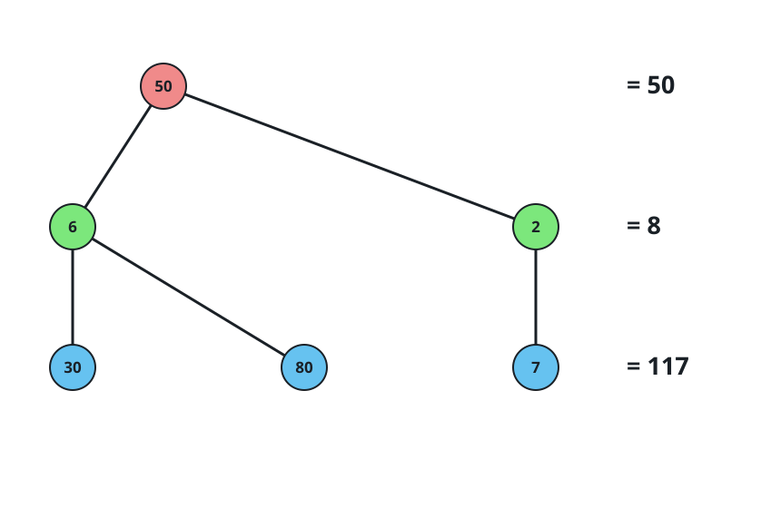
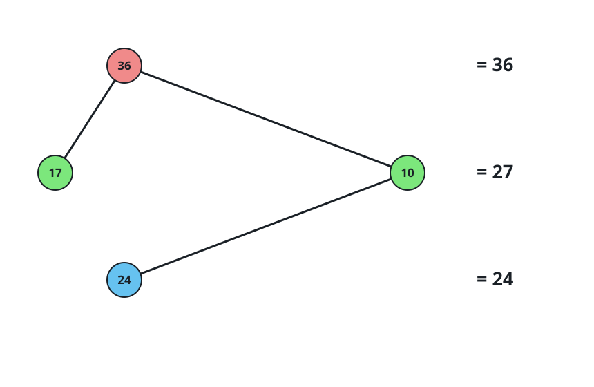
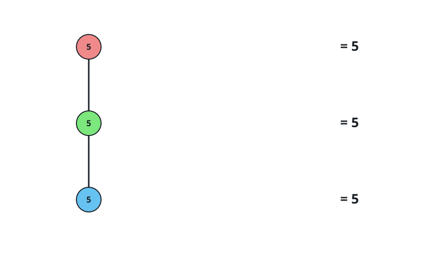

# Find the Level of Tree with Minimum Sum

## Description

Given the `root` of a binary tree `root` where each node has a value,
return the level of the tree that has the minimum sum of values among all
the levels (in case of a tie, return the lowest level).

Note that the root of the tree is at level 1 and the level of any other
node is its distance from the root + 1.

### Example 1



```text
Input: root = [50,6,2,30,80,7]
Output: 2
```

### Example 2



```text
Input: root = [36,17,10,null,null,24]
Output: 3
```

### Example 3



```text
Input: root = [5,null,5,null,5]
Output: 1
```

### Constraints

- The number of nodes in the tree is in the range `[1, 10⁵]`.
- `1 <= Node.val <= 10⁹`

## Hints

### Hint 1

Run a DFS on the tree and update an array sum where sum[i] is the sum for level i.

### Hint 2

The answer is the first minimum element of sum.
