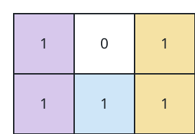

# Find the Minimum Area to Cover All Ones II

## Description

You are given a 2D binary array `grid`. You need to find 3 non-overlapping
rectangles having non-zero areas with horizontal and vertical sides such
that all the 1's in `grid` lie inside these rectangles.

Return the minimum possible sum of the area of these rectangles.

Note that the rectangles are allowed to touch.

### Example 1



```text
Input: grid = [[1,0,1],[1,1,1]]
Output: 5
Explanation: The 1's at (0, 0) and (1, 0) are covered by a rectangle of
area 2.
The 1's at (0, 2) and (1, 2) are covered by a rectangle of area 2.
The 1 at (1, 1) is covered by a rectangle of area 1.
```

### Example 2


```text
Input: grid = [[1,0,1,0],[0,1,0,1]]
Output: 5
Explanation: The 1's at (0, 0) and (0, 2) are covered by a rectangle of
area 3.
The 1 at (1, 1) is covered by a rectangle of area 1.
The 1 at (1, 3) is covered by a rectangle of area 1.
```

### Constraints

- `1 <= grid.length, grid[i].length <= 30`
- `grid[i][j]` is either `0` or `1`.
- The input is generated such that there are at least three 1's in `grid`.

## Hints

### Hint 1

Consider covering using 2 rectangles. As the rectangles don’t overlap, one of the rectangles must either be vertically above or horizontally left to the other.

### Hint 2

To find the minimum area, check all possible vertical and horizontal splits.

### Hint 3

For 3 rectangles, extend the idea to first covering using one rectangle, and then try splitting leftover ones both horizontally and vertically.
