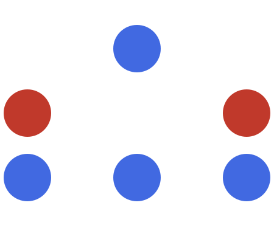
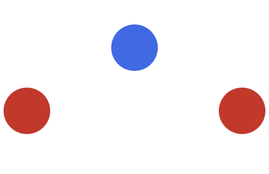

# Maximum Height of a Triangle

## Description

You are given two integers `red` and `blue` representing the count of red
and blue colored balls. You have to arrange these balls to form a triangle
such that the 1st row will have 1 ball, the 2nd row will have 2 balls, the
3rd row will have 3 balls, and so on.

All the balls in a particular row should be the same color, and adjacent
rows should have different colors.

Return the maximum height of the triangle that can be achieved.

### Example 1



```text
Input: red = 2, blue = 4
Output: 3
Explanation: The only possible arrangement is shown above.
```

### Example 2



```text
Input: red = 2, blue = 1
Output: 2
Explanation: The only possible arrangement is shown above.
```

### Example 3

```text
Input: red = 1, blue = 1
Output: 1
```

### Example 4


```text
Input: red = 10, blue = 1
Output: 2
Explanation: The only possible arrangement is shown above.
```

### Constraints

- `1 <= red, blue <= 100`

## Hints

### Hint 1

Count the max height using both possibilities. That is, red ball as top and blue ball as top.

### Hint 2

For counting the max height, use a simple for loop and remove the number of balls required at this level.
