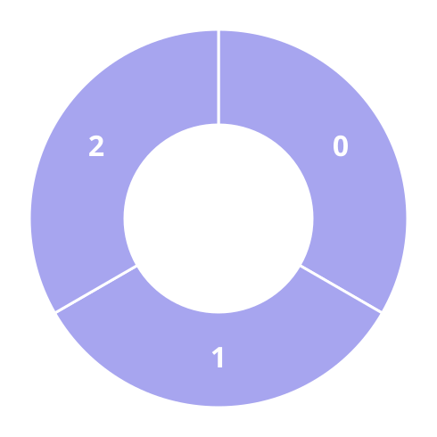
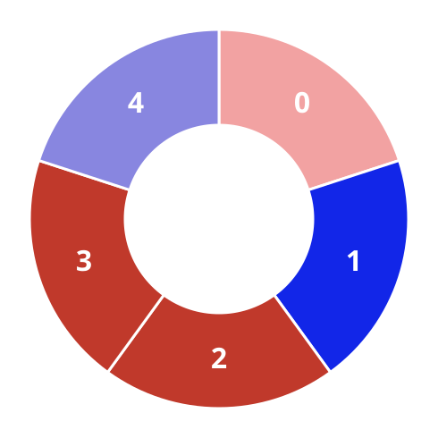

# Alternating Groups I

## Description

There is a circle of red and blue tiles. You are given an array of integers
`colors`. The color of tile `i` is represented by `colors[i]`:

- `colors[i] == 0` means that tile `i` is red.
- `colors[i] == 1` means that tile `i` is blue.

Every 3 contiguous tiles in the circle with alternating colors (the middle
tile has a different color from its left and right tiles) is called an
alternating group.

Return the number of alternating groups.

Note that since `colors` represents a circle, the first and the last tiles
are considered to be next to each other.

### Example 1



```text
Input: colors = [1,1,1]
Output: 0
```

### Example 2




```text
Input: colors = [0,1,0,0,1]
Output: 3
```

### Constraints

- `3 <= colors.length <= 100`
- `0 <= colors[i] <= 1`

## Hints

### Hint 1

For each tile, check that the previous and the next tile have different
colors from that tile or not.
