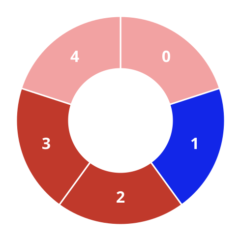
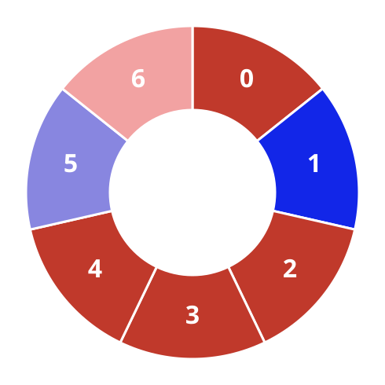
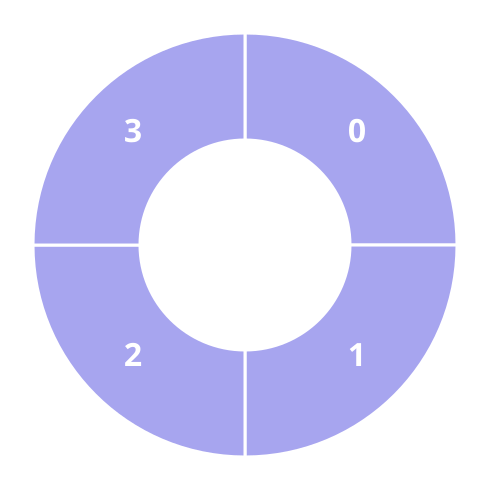

# Alternating Groups II

## Description

There is a circle of red and blue tiles. You are given an array of integers
`colors` and an integer `k`. The color of tile `i` is represented by
`colors[i]`:

- `colors[i] == 0` means that tile `i` is red.
- `colors[i] == 1` means that tile `i` is blue.

An alternating group is every k contiguous tiles in the circle with
alternating colors (each tile in the group except the first and last one has
a different color from its left and right tiles).

Return the number of alternating groups.

Note that since `colors` represents a circle, the first and the last tiles
are considered to be next to each other.

### Example 1





```text
Input: colors = [0,1,0,1,0], k = 3
Output: 3
```

### Example 2





```text
Input: colors = [0,1,0,0,1,0,1], k = 6
Output: 2
```

### Example 3



```text
Input: colors = [1,1,0,1], k = 4
Output: 0
```

### Constraints

- `3 <= colors.length <= 10⁵`
- `0 <= colors[i] <= 1`
- `3 <= k <= colors.length`

## Hints

### Hint 1

Try to find a tile that has the same color as its next tile (if it exists).

### Hint 2

Then try to find maximal alternating groups by starting a single for loop
from that tile.
