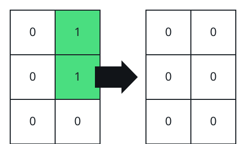
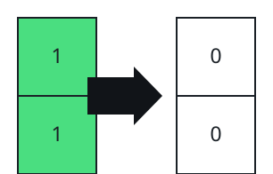

# Minimum Number of Flips to Make Binary Grid Palindromic II

## Description

You are given an `m x n` binary matrix `grid`.

A row or column is considered palindromic if its values read the same
forward and backward.

You can flip any number of cells in `grid` from `0` to `1`, or from `1`
to `0`.

Return the minimum number of cells that need to be flipped to make all
rows and columns palindromic, and the total number of 1's in `grid`
divisible by 4.

### Example 1


```text
Input: grid = [[1,0,0],[0,1,0],[0,0,1]]
Output: 3
```

### Example 2



```text
Input: grid = [[0,1],[0,1],[0,0]]
Output: 2
```

### Example 3



```text
Input: grid = [[1],[1]]
Output: 2
```

### Constraints

- `m == grid.length`
- `n == grid[i].length`
- `1 <= m * n <= 2 * 10⁵`
- `0 <= grid[i][j] <= 1`

## Hints

### Hint 1

For each (x, y), find (m - 1 - x, y), (m - 1 - x, n - 1 - y), and
(x, n - 1 - y); they should be the same.

### Hint 2

Note that we need to specially handle the middle row (column) if the number
of rows (columns) is odd.
