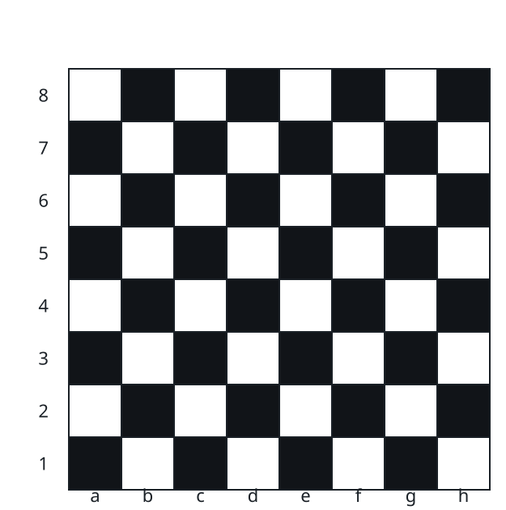

# Check if Two Chessboard Squares Have the Same Color

## Description



You are given two strings, `coordinate1` and `coordinate2`, representing
the coordinates of a square on an 8 x 8 chessboard. The board carries the
standard alternating coloring: starting from black `"a1"`, every step to
an adjacent square switches the color, so a square is black exactly when
the position of its column letter (`a` through `h` number 1 through 8)
plus its row number is even, and white otherwise.

Return `true` if these two squares have the same color and `false`
otherwise.

The coordinate will always represent a valid chessboard square. The
coordinate will always have the letter first (indicating its column), and
the number second (indicating its row).

### Example 1

```text
Input: coordinate1 = "a1", coordinate2 = "c3"
Output: true
Explanation: Both squares are black.
```

### Example 2

```text
Input: coordinate1 = "a1", coordinate2 = "h3"
Output: false
Explanation: Square "a1" is black and "h3" is white.
```

### Constraints

- `coordinate1.length == coordinate2.length == 2`
- `'a' <= coordinate1[0], coordinate2[0] <= 'h'`
- `'1' <= coordinate1[1], coordinate2[1] <= '8'`

## Hints

### Hint 1

The color of the chessboard is black if the sum of row coordinates and
column coordinates is even. Otherwise, it's white.
