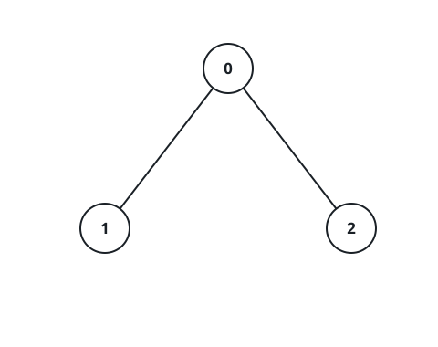
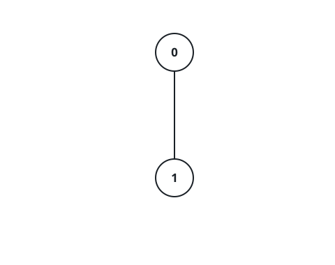

# Find the Last Marked Nodes in Tree

## Description

There exists an undirected tree with `n` nodes numbered 0 to n - 1. You are
given a 2D integer array `edges` of length n - 1, where
`edges[i] = [ui, vi]` indicates that there is an edge between nodes `ui` and
`vi` in the tree.

Initially, all nodes are unmarked. After every second, you mark all unmarked
nodes which have at least one marked node adjacent to them.

Return an array `nodes` where `nodes[i]` is the last node to get marked in
the tree, if you mark node `i` at time t = 0. If `nodes[i]` has multiple
answers for any node `i`, you can choose any one answer.

### Example 1



```text
Input: edges = [[0,1],[0,2]]
Output: [2,2,1]
Explanation:
For i = 0, the nodes are marked in the sequence: [0] -> [0,1,2]. Either 1 or
2 can be the answer.
For i = 1, the nodes are marked in the sequence: [1] -> [0,1] -> [0,1,2].
Node 2 is marked last.
For i = 2, the nodes are marked in the sequence: [2] -> [0,2] -> [0,1,2].
Node 1 is marked last.
```

### Example 2



```text
Input: edges = [[0,1]]
Output: [1,0]
Explanation:
For i = 0, the nodes are marked in the sequence: [0] -> [0,1].
For i = 1, the nodes are marked in the sequence: [1] -> [0,1].
```

### Example 3


```text
Input: edges = [[0,1],[0,2],[2,3],[2,4]]
Output: [3,3,1,1,1]
Explanation:
For i = 0, the nodes are marked in the sequence: [0] -> [0,1,2] ->
[0,1,2,3,4].
For i = 1, the nodes are marked in the sequence: [1] -> [0,1] -> [0,1,2] ->
[0,1,2,3,4].
For i = 2, the nodes are marked in the sequence: [2] -> [0,2,3,4] ->
[0,1,2,3,4].
For i = 3, the nodes are marked in the sequence: [3] -> [2,3] -> [0,2,3,4]
-> [0,1,2,3,4].
For i = 4, the nodes are marked in the sequence: [4] -> [2,4] -> [0,2,3,4]
-> [0,1,2,3,4].
```

### Constraints

- `2 <= n <= 10⁵`
- `edges.length == n - 1`
- `edges[i].length == 2`
- `0 <= edges[i][0], edges[i][1] <= n - 1`
- The input is generated such that `edges` represents a valid tree.

## Hints

### Hint 1

We need to calculate the height of tree when rooted at each node.

### Hint 2

Find a diameter using two DFS.

### Hint 3

The farthest node from each node must be one of the endpoints of the
diameter.

### Hint 4

The last marked node will be one of the end of the diameter, whichever is
more distant.
