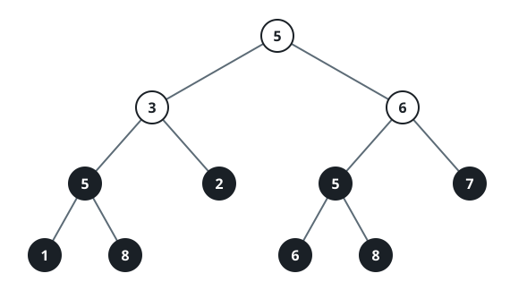
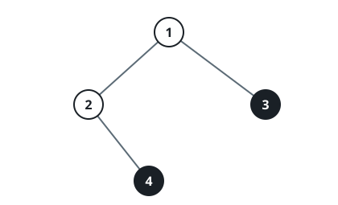

# K-th Largest Perfect Subtree Size in Binary Tree

## Description

You are given the root of a binary tree and an integer k.

Return an integer denoting the size of the kth largest perfect binary
subtree, or -1 if it doesn't exist.

A perfect binary tree is a tree where all leaves are on the same level, and
every parent has two children.

### Example 1



```text
Input: root = [5,3,6,5,2,5,7,1,8,null,null,6,8], k = 2
Output: 3
Explanation: The roots of the perfect binary subtrees are highlighted in
black. Their sizes, in non-increasing order are [3, 3, 1, 1, 1, 1, 1, 1].
The 2nd largest size is 3.
```

### Example 2


```text
Input: root = [1,2,3,4,5,6,7], k = 1
Output: 7
Explanation: The sizes of the perfect binary subtrees in non-increasing
order are [7, 3, 3, 1, 1, 1, 1]. The size of the largest perfect binary
subtree is 7.
```

### Example 3



```text
Input: root = [1,2,3,null,4], k = 3
Output: -1
Explanation: The sizes of the perfect binary subtrees in non-increasing
order are [1, 1]. There are fewer than 3 perfect binary subtrees.
```

### Constraints

- The number of nodes in the tree is in the range `[1, 2000]`.
- `1 <= Node.val <= 2000`
- `1 <= k <= 1024`

## Hints

### Hint 1

For a subtree to form a perfect binary subtree, its children should also be
perfect binary subtrees.

### Hint 2

Check recursively that both the node and its children are perfect binary
subtrees.

### Hint 3

Gather all the perfect binary subtrees and return the kth largest.
