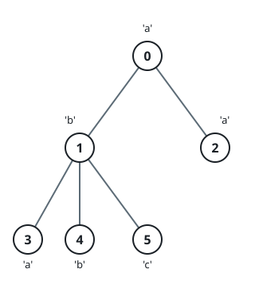

# Find Subtree Sizes After Changes

## Description

You are given a tree rooted at node 0 that consists of n nodes numbered
from 0 to n - 1. The tree is represented by an array parent of size n,
where parent[i] is the parent of node i. Since node 0 is the root,
parent[0] == -1.

You are also given a string s of length n, where s[i] is the character
assigned to node i.

We make the following changes on the tree one time simultaneously for all
nodes x from 1 to n - 1:

1. Find the closest node y to node x such that y is an ancestor of x, and
   s[x] == s[y].
2. If node y does not exist, do nothing.
3. Otherwise, remove the edge between x and its current parent and make
   node y the new parent of x by adding an edge between them.

Return an array answer of size n where answer[i] is the size of the
subtree rooted at node i in the final tree.

### Example 1



```text
Input: parent = [-1,0,0,1,1,1], s = "abaabc"
Output: [6,3,1,1,1,1]
Explanation: The parent of node 3 will change from node 1 to node 0.
```

### Example 2


```text
Input: parent = [-1,0,4,0,1], s = "abbba"
Output: [5,2,1,1,1]
Explanation:
- The parent of node 4 will change from node 1 to node 0.
- The parent of node 2 will change from node 4 to node 1.
```

### Constraints

- `n == parent.length == s.length`
- `1 <= n <= 10⁵`
- `0 <= parent[i] <= n - 1 for all i >= 1.`
- `parent[0] == -1`
- `parent represents a valid tree.`
- `s consists only of lowercase English letters.`

## Hints

### Hint 1

Perform a depth-first search on the tree, starting from the root.

### Hint 2

During the DFS, keep track of the most recent node where each character
from 'a' to 'z' has been seen.
