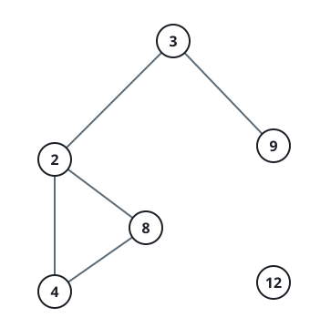

# Count Connected Components in LCM Graph

## Description

You are given an array of integers nums of size n and a positive integer
threshold.

There is a graph consisting of n nodes with the ith node having a value of
nums[i]. Two nodes i and j in the graph are connected via an undirected
edge if lcm(nums[i], nums[j]) <= threshold.

Return the number of connected components in this graph.

A connected component is a subgraph of a graph in which there exists a
path between any two vertices, and no vertex of the subgraph shares an
edge with a vertex outside of the subgraph.

The term lcm(a, b) denotes the least common multiple of a and b.

### Example 1


```text
Input: nums = [2,4,8,3,9], threshold = 5
Output: 4
Explanation: The four connected components are (2, 4), (3), (8), (9).
```

### Example 2



```text
Input: nums = [2,4,8,3,9,12], threshold = 10
Output: 2
Explanation: The two connected components are (2, 3, 4, 8, 9), and (12).
```

### Constraints

- `1 <= nums.length <= 10⁵`
- `1 <= nums[i] <= 10⁹`
- All elements of nums are unique.
- `1 <= threshold <= 2 * 10⁵`

## Hints

### Hint 1

Use DSU

### Hint 2

Connect a number to all its multiples less than threshold
