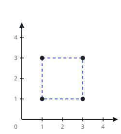

# Maximum Area Rectangle With Point Constraints I

## Description

You are given an array `points` where `points[i] = [xi, yi]` represents the
coordinates of a point on an infinite plane.

Your task is to find the maximum area of a rectangle that:

- Can be formed using four of these points as its corners.
- Does not contain any other point inside or on its border.
- Has its edges parallel to the axes.

Return the maximum area that you can obtain or -1 if no such rectangle is
possible.

### Example 1



```text
Input: points = [[1,1],[1,3],[3,1],[3,3]]
Output: 4
Explanation: We can make a rectangle with these 4 points as corners and
there is no other point that lies inside or on the border. Hence, the
maximum possible area would be 4.
```

### Example 2


```text
Input: points = [[1,1],[1,3],[3,1],[3,3],[2,2]]
Output: -1
Explanation: There is only one rectangle possible is with points [1,1],
[1,3], [3,1] and [3,3] but [2,2] will always lie inside it. Hence,
returning -1.
```

### Example 3


```text
Input: points = [[1,1],[1,3],[3,1],[3,3],[1,2],[3,2]]
Output: 2
Explanation: The maximum area rectangle is formed by the points [1,3],
[1,2], [3,2], [3,3], which has an area of 2. Additionally, the points
[1,1], [1,2], [3,1], [3,2] also form a valid rectangle with the same area.
```

### Constraints

- `1 <= points.length <= 10`
- `points[i].length == 2`
- `0 <= xi, yi <= 100`
- All the given points are unique.

## Hints

### Hint 1

If `(x1, y1)` and `(x2, y2)` are two opposite corners of a rectangle, then
the other two would be `(x1, y2)` and `(x2, y1)`.

### Hint 2

Fix two points and find the other two using a set data structure.

### Hint 3

After determining the rectangle, iterate through the array of points to
ensure no point lies on the rectangle’s border or within its interior.
