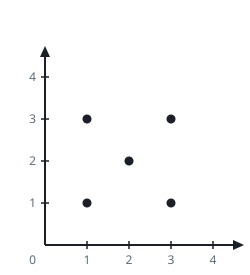

# Maximum Area Rectangle With Point Constraints II

## Description

There are n points on an infinite plane. You are given two integer arrays
xCoord and yCoord where (xCoord[i], yCoord[i]) represents the
coordinates of the ith point.

Your task is to find the maximum area of a rectangle that:

- Can be formed using four of these points as its corners.
- Does not contain any other point inside or on its border.
- Has its edges parallel to the axes.

Return the maximum area that you can obtain or -1 if no such rectangle is
possible.

### Example 1


```text
Input: xCoord = [1,1,3,3], yCoord = [1,3,1,3]
Output: 4
Explanation: We can make a rectangle with these 4 points as corners and
there is no other point that lies inside or on the border. Hence, the
maximum possible area would be 4.
```

### Example 2



```text
Input: xCoord = [1,1,3,3,2], yCoord = [1,3,1,3,2]
Output: -1
Explanation: There is only one rectangle possible is with points [1,1],
[1,3], [3,1] and [3,3] but [2,2] will always lie inside it. Hence,
returning -1.
```

### Example 3


```text
Input: xCoord = [1,1,3,3,1,3], yCoord = [1,3,1,3,2,2]
Output: 2
Explanation: The maximum area rectangle is formed by the points [1,3],
[1,2], [3,2], [3,3], which has an area of 2. Additionally, the points
[1,1], [1,2], [3,1], [3,2] also form a valid rectangle with the same
area.
```

### Constraints

- `1 <= xCoord.length == yCoord.length <= 2 * 10⁵`
- `0 <= xCoord[i], yCoord[i] <= 8 * 10⁷`
- All the given points are unique.

## Hints

### Hint 1

Process the points by sorting them based on their x-coordinates.

### Hint 2

For each x-coordinate, sort the corresponding points by y and select two
consecutive points y1 and y2 (y1 < y2).

### Hint 3

Identify the closest x-coordinate (greater than the current x) where some
y-coordinates lie in [y1, y2].

### Hint 4

Use a segment tree to efficiently locate the nearest x-coordinate.

### Hint 5

Check if the points form a valid rectangle. How?
