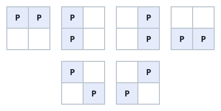

# Manhattan Distances of All Arrangements of Pieces

## Description

You are given three integers m, n, and k.

There is a rectangular grid of size m × n containing k identical pieces. Return
the sum of Manhattan distances between every pair of pieces over all valid
arrangements of pieces.

A valid arrangement is a placement of all k pieces on the grid with at most one
piece per cell.

Since the answer may be very large, return it modulo 10⁹ + 7.

The Manhattan Distance between two cells (xi, yi) and (xj, yj) is
|xi - xj| + |yi - yj|.

### Example 1




```text
Input: m = 2, n = 2, k = 2
Output: 8
Explanation: The valid arrangements of pieces on the board are: In the first 4
arrangements, the Manhattan distance between the two pieces is 1. In the last 2
arrangements, the Manhattan distance between the two pieces is 2. Thus, the
total Manhattan distance across all valid arrangements is 1 + 1 + 1 + 1 + 2 +
2 = 8.
```

### Example 2


```text
Input: m = 1, n = 4, k = 3
Output: 20
Explanation: The valid arrangements of pieces on the board are: The first and
last arrangements have a total Manhattan distance of 1 + 1 + 2 = 4. The middle
two arrangements have a total Manhattan distance of 1 + 2 + 3 = 6. The total
Manhattan distance between all pairs of pieces across all arrangements is
4 + 6 + 6 + 4 = 20.
```

### Constraints

- `1 <= m, n <= 10⁵`
- `2 <= m * n <= 10⁵`
- `2 <= k <= m * n`

## Hints

### Hint 1

Fix two pieces in two specific locations and find the number of boards where
this can happen.

### Hint 2

A particular pair of positions will be counted exactly C(m * n - 2, k - 2)
times. Calculate the total distance for all pairs of positions and multiply it
with C(m * n - 2, k - 2).
