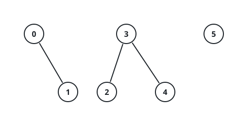

# Properties Graph

## Description

You are given a 2D integer array `properties` having dimensions `n x m` and an
integer `k`.

Define a function `intersect(a, b)` that returns the number of distinct
integers common to both arrays `a` and `b`.

Construct an undirected graph where each index `i` corresponds to
`properties[i]`. There is an edge between node `i` and node `j` if and only if
`intersect(properties[i], properties[j]) >= k`, where `i` and `j` are in the
range `[0, n - 1]` and `i != j`.

Return the number of connected components in the resulting graph.

### Example 1



```text
Input: properties = [[1,2],[1,1],[3,4],[4,5],[5,6],[7,7]], k = 1
Output: 3
Explanation: The graph formed has 3 connected components:
```

### Example 2


```text
Input: properties = [[1,2,3],[2,3,4],[4,3,5]], k = 2
Output: 1
Explanation: The graph formed has 1 connected component:
```

### Example 3

```text
Input: properties = [[1,1],[1,1]], k = 2
Output: 2
Explanation: intersect(properties[0], properties[1]) = 1, which is less than
k. This means there is no edge between properties[0] and properties[1] in the
graph.
```

### Constraints

- `1 <= n == properties.length <= 100`
- `1 <= m == properties[i].length <= 100`
- `1 <= properties[i][j] <= 100`
- `1 <= k <= m`

## Hints

### Hint 1

How can we optimally find the intersection of two arrays? One way is to use
`len(set(a) & set(b))`.

### Hint 2

For connected components, think about using DFS, BFS, or DSU.
