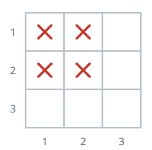
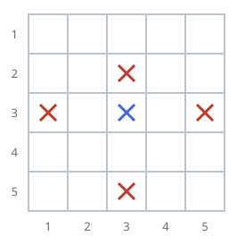

# Count Covered Buildings

## Description

You are given a positive integer `n`, representing an n x n city. You are
also given a 2D grid `buildings`, where `buildings[i] = [x, y]` denotes a
unique building located at coordinates `[x, y]`.

A building is covered if there is at least one building in all four
directions: left, right, above, and below.

Return the number of covered buildings.

### Example 1


```text
Input: n = 3, buildings = [[1,2],[2,2],[3,2],[2,1],[2,3]]
Output: 1
Explanation:
Only building [2,2] is covered as it has at least one building:

    above ([1,2])
    below ([3,2])
    left ([2,1])
    right ([2,3])

Thus, the count of covered buildings is 1.
```

### Example 2



```text
Input: n = 3, buildings = [[1,1],[1,2],[2,1],[2,2]]
Output: 0
Explanation: No building has at least one building in all four directions.
```

### Example 3



```text
Input: n = 5, buildings = [[1,3],[3,2],[3,3],[3,5],[5,3]]
Output: 1
Explanation:
Only building [3,3] is covered as it has at least one building:

    above ([1,3])
    below ([5,3])
    left ([3,2])
    right ([3,5])

Thus, the count of covered buildings is 1.
```

### Constraints

- `2 <= n <= 10⁵`
- `1 <= buildings.length <= 10⁵`
- `buildings[i] = [x, y]`
- `1 <= x, y <= n`
- All coordinates of buildings are unique.

## Hints

### Hint 1

Group buildings with the same x or y value together, and sort each group.

### Hint 2

In each sorted list, the buildings that are not at the first or last
positions are covered in that direction.
