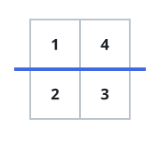

# Equal Sum Grid Partition I

## Description

You are given an m x n matrix `grid` of positive integers. Your task is to
determine if it is possible to make either one horizontal or one vertical
cut on the grid such that:

- Each of the two resulting sections formed by the cut is non-empty.
- The sum of the elements in both sections is equal.

Return true if such a partition exists; otherwise return false.

### Example 1




```text
Input: grid = [[1,4],[2,3]]
Output: true
Explanation: A horizontal cut between row 0 and row 1 results in two non-empty sections, each with a sum of 5. Thus, the answer is true.
```

### Example 2

```text
Input: grid = [[1,3],[2,4]]
Output: false
Explanation: No horizontal or vertical cut results in two non-empty sections with equal sums. Thus, the answer is false.
```

### Constraints

- `1 <= m == grid.length <= 10⁵`
- `1 <= n == grid[i].length <= 10⁵`
- `2 <= m * n <= 10⁵`
- `1 <= grid[i][j] <= 10⁵`

## Hints

### Hint 1

There are two types of cuts: a horizontal cut or a vertical cut.

### Hint 2

For a horizontal cut at row r (0 <= r < m - 1) splits the grid into rows 0...r vs. r+1...m-1 and compare their sums.

### Hint 3

For a vertical cut at column c (0 <= c < n - 1) splits the grid into columns 0...c vs. c+1...n-1 and compare their sums.

### Hint 4

Brute‑force all possible r and c cuts; if any yields equal section sums, return true.
