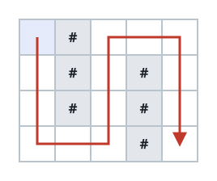

# Grid Teleportation Traversal

## Description

You are given a 2D character grid `matrix` of size `m x n`, represented as an
array of strings, where `matrix[i][j]` represents the cell at the intersection
of the `ith` row and `jth` column. Each cell is one of the following:

- `'.'` representing an empty cell.
- `'#'` representing an obstacle.
- An uppercase letter (`'A'`-`'Z'`) representing a teleportation portal.

You start at the top-left cell `(0, 0)`, and your goal is to reach the
bottom-right cell `(m - 1, n - 1)`. You can move from the current cell to any
adjacent cell (up, down, left, right) as long as the destination cell is within
the grid bounds and is not an obstacle.

If you step on a cell containing a portal letter and you haven't used that
portal letter before, you may instantly teleport to any other cell in the grid
with the same letter. This teleportation does not count as a move, but each
portal letter can be used at most once during your journey.

Return the minimum number of moves required to reach the bottom-right cell. If
it is not possible to reach the destination, return `-1`.

### Example 1


```text
Input: matrix = ["A..",".A.","..."]
Output: 2
Explanation:
Before the first move, teleport from (0, 0) to (1, 1).
In the first move, move from (1, 1) to (1, 2).
In the second move, move from (1, 2) to (2, 2).
```

### Example 2



```text
Input: matrix = [".#...",".#.#.",".#.#.","...#."]
Output: 13
```

### Constraints

- `1 <= m == matrix.length <= 10³`
- `1 <= n == matrix[i].length <= 10³`
- `matrix[i][j]` is either `'#'`, `'.'`, or an uppercase English letter.
- `matrix[0][0]` is not an obstacle.

## Hints

### Hint 1

Treat all portals with the same letter as connected-like one big super-node.

### Hint 2

Each portal letter is used at most once, but that doesn't affect correctness
since we visit each cell only once in the shortest path.

### Hint 3

Use Breadth-First Search to find the minimum number of moves.
