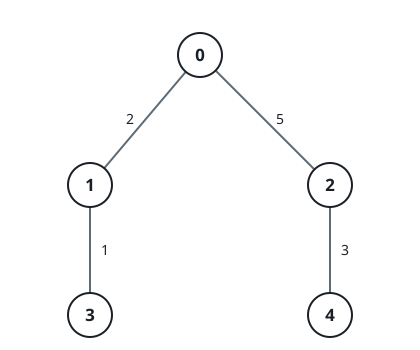

# Find Weighted Median Node in Tree

## Description

You are given an integer `n` and an undirected, weighted tree rooted at
node `0` with `n` nodes numbered from `0` to `n - 1`. This is represented
by a 2D array `edges` of length `n - 1`, where `edges[i] = [ui, vi, wi]`
indicates an edge from node `ui` to node `vi` with weight `wi`.

The weighted median node is defined as the first node `x` on the path
from `ui` to `vi` such that the sum of edge weights from `ui` to `x` is
greater than or equal to half of the total path weight.

You are given a 2D integer array `queries`. For each `queries[j] =
[uj, vj]`, determine the weighted median node along the path from `uj`
to `vj`.

Return an array `ans`, where `ans[j]` is the node index of the weighted
median for `queries[j]`.

### Example 1


```text
Input: n = 2, edges = [[0,1,7]], queries = [[1,0],[0,1]]
Output: [0,1]
Explanation: For query [1, 0] the path is 1 → 0 with edge weights [7],
    total path weight 7, half 3.5: sum from 1 → 0 = 7 >= 3.5, median is
    node 0. For query [0, 1] the path is 0 → 1 with edge weights [7],
    total path weight 7, half 3.5: sum from 0 → 1 = 7 >= 3.5, median is
    node 1.
```

### Example 2


```text
Input: n = 3, edges = [[0,1,2],[2,0,4]], queries = [[0,1],[2,0],[1,2]]
Output: [1,0,2]
Explanation: For query [0, 1] the path is 0 → 1 with edge weights [2],
    total path weight 2, half 1: sum from 0 → 1 = 2 >= 1, median is node
    1. For query [2, 0] the path is 2 → 0 with edge weights [4], total
    path weight 4, half 2: sum from 2 → 0 = 4 >= 2, median is node 0.
    For query [1, 2] the path is 1 → 0 → 2 with edge weights [2, 4],
    total path weight 6, half 3: sum from 1 → 0 = 2 < 3, sum from 1 → 2
    = 2 + 4 = 6 >= 3, median is node 2.
```

### Example 3



```text
Input: n = 5, edges = [[0,1,2],[0,2,5],[1,3,1],[2,4,3]],
    queries = [[3,4],[1,2]]
Output: [2,2]
Explanation: For query [3, 4] the path is 3 → 1 → 0 → 2 → 4 with edge
    weights [1, 2, 5, 3], total path weight 11, half 5.5: sum from 3 →
    1 = 1 < 5.5, sum from 3 → 0 = 1 + 2 = 3 < 5.5, sum from 3 → 2 = 1 +
    2 + 5 = 8 >= 5.5, median is node 2. For query [1, 2] the path is
    1 → 0 → 2 with edge weights [2, 5], total path weight 7, half 3.5:
    sum from 1 → 0 = 2 < 3.5, sum from 1 → 2 = 2 + 5 = 7 >= 3.5, median
    is node 2.
```

### Constraints

- `2 <= n <= 10⁵`
- `edges.length == n - 1`
- `edges[i] == [ui, vi, wi]`
- `0 <= ui, vi < n`
- `1 <= wi <= 10⁹`
- `1 <= queries.length <= 10⁵`
- `queries[j] == [uj, vj]`
- `0 <= uj, vj < n`
- The input is generated such that edges represents a valid tree.

## Hints

### Hint 1

Use binary lifting and lowest common ancestor.

### Hint 2

Let the query nodes be u and v, with lowest common ancestor l and total
path weight tot.

### Hint 3

If the median lies on the path from u up to l: find the first node where
2 * sum >= tot (equivalently, the last node where 2 * sum < tot, and
move one node above).

### Hint 4

Otherwise, it lies on the path from v up to l: use the same
2 * sum >= tot criterion as you climb.

### Hint 5

In both cases, binary lifting with sparse tables lets you jump by powers
of two while tracking cumulative weights to locate the weighted median
in O(log n).
