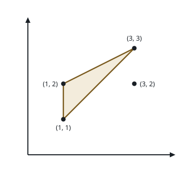

# Find Maximum Area of a Triangle

## Description

You are given a 2D array `coords` of size `n x 2`, representing the
coordinates of `n` points in an infinite Cartesian plane.

Find twice the maximum area of a triangle with its corners at any three
elements from `coords`, such that at least one side of this triangle is
parallel to the x-axis or y-axis. Formally, if the maximum area of such
a triangle is `A`, return `2 * A`.

If no such triangle exists, return `-1`.

Note that a triangle cannot have zero area.

### Example 1



```text
Input: coords = [[1,1],[1,2],[3,2],[3,3]]
Output: 2
Explanation: The triangle shown in the image has a base 1 and height 2.
    Hence its area is 1/2 * base * height = 1.
```

### Example 2

```text
Input: coords = [[1,1],[2,2],[3,3]]
Output: -1
Explanation: The only possible triangle has corners (1, 1), (2, 2), and
    (3, 3). None of its sides are parallel to the x-axis or the y-axis.
```

### Constraints

- `1 <= n == coords.length <= 10⁵`
- `1 <= coords[i][0], coords[i][1] <= 10⁶`
- `All coords[i] are unique.`

## Hints

### Hint 1

area * 2 = base * height

### Hint 2

Let the base be parallel to the x‑axis or y‑axis

### Hint 3

Sort to find the maximum base for each fixed x (or y), then the maximum
height comes from the extreme values of the other coordinate.
