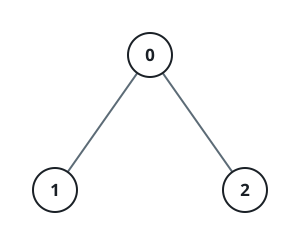

# Kth Smallest Path XOR Sum

## Description

You are given an undirected tree rooted at node 0 with n nodes numbered from
0 to n - 1. Each node i has an integer value vals[i], and its parent is
given by par[i].

The path XOR sum from the root to a node u is defined as the bitwise XOR of
all vals[i] for nodes i on the path from the root node to node u, inclusive.

You are given a 2D integer array queries, where queries[j] = [uj, kj]. For
each query, find the kjth smallest distinct path XOR sum among all nodes in
the subtree rooted at uj. If there are fewer than kj distinct path XOR sums
in that subtree, the answer is -1.

Return an integer array where the jth element is the answer to the jth
query.

In a rooted tree, the subtree of a node v includes v and all nodes whose
path to the root passes through v, that is, v and its descendants.

### Example 1



```text
Input: par = [-1,0,0], vals = [1,1,1], queries = [[0,1],[0,2],[0,3]]
Output: [0,1,-1]
Explanation:

Path XORs:

    Node 0: 1
    Node 1: 1 XOR 1 = 0
    Node 2: 1 XOR 1 = 0

Subtree of 0: Subtree rooted at node 0 includes nodes [0, 1, 2] with Path
XORs = [1, 0, 0]. The distinct XORs are [0, 1].

Queries:

    queries[0] = [0, 1]: The 1st smallest distinct path XOR in the subtree
    of node 0 is 0.
    queries[1] = [0, 2]: The 2nd smallest distinct path XOR in the subtree
    of node 0 is 1.
    queries[2] = [0, 3]: Since there are only two distinct path XORs in
    this subtree, the answer is -1.

Output: [0, 1, -1]
```

### Example 2


```text
Input: par = [-1,0,1], vals = [5,2,7], queries = [[0,1],[1,2],[1,3],[2,1]]
Output: [0,7,-1,0]
Explanation:

Path XORs:

    Node 0: 5
    Node 1: 5 XOR 2 = 7
    Node 2: 5 XOR 2 XOR 7 = 0

Subtrees and Distinct Path XORs:

    Subtree of 0: Subtree rooted at node 0 includes nodes [0, 1, 2] with
    Path XORs = [5, 7, 0]. The distinct XORs are [0, 5, 7].
    Subtree of 1: Subtree rooted at node 1 includes nodes [1, 2] with Path
    XORs = [7, 0]. The distinct XORs are [0, 7].
    Subtree of 2: Subtree rooted at node 2 includes only node [2] with
    Path XOR = [0]. The distinct XORs are [0].

Queries:

    queries[0] = [0, 1]: The 1st smallest distinct path XOR in the subtree
    of node 0 is 0.
    queries[1] = [1, 2]: The 2nd smallest distinct path XOR in the subtree
    of node 1 is 7.
    queries[2] = [1, 3]: Since there are only two distinct path XORs, the
    answer is -1.
    queries[3] = [2, 1]: The 1st smallest distinct path XOR in the subtree
    of node 2 is 0.

Output: [0, 7, -1, 0]
```

### Constraints

- `1 <= n == vals.length <= 5 * 10⁴`
- `0 <= vals[i] <= 10⁵`
- `par.length == n`
- `par[0] == -1`
- `0 <= par[i] < n for i in [1, n - 1]`
- `1 <= queries.length <= 5 * 10⁴`
- `queries[j] == [uj, kj]`
- `0 <= uj < n`
- `1 <= kj <= n`
- The input is generated such that the parent array par represents a valid
  tree.

## Hints

### Hint 1

For each node u, maintain the set of XOR values along the path from the
root to u.

### Hint 2

Use DSU on tree (small‑to‑large merging) during DFS to efficiently merge
each child's set into its parent's set.

### Hint 3

Store all XOR values in an ordered_set (in Python you can use the
sortedcontainers module's SortedList) so you can quickly find the kth
smallest XOR in any subtree.

### Hint 4

At node u, process each query [u, k] by calling find_by_order(k − 1) (C++
PBDS) or indexing sorted_list[k-1] (Python SortedList).
