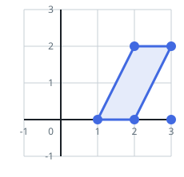
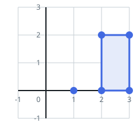
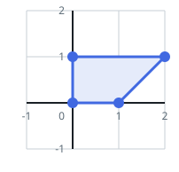

# Count Number of Trapezoids I

## Description

You are given a 2D integer array `points`, where `points[i] = [xi, yi]`
represents the coordinates of the ith point on the Cartesian plane.

A horizontal trapezoid is a convex quadrilateral with at least one pair
of horizontal sides (i.e. parallel to the x-axis). Two lines are parallel
if and only if they have the same slope.

Return the number of unique horizontal trapezoids that can be formed by
choosing any four distinct points from `points`.

Since the answer may be very large, return it modulo `10⁹ + 7`.

### Example 1






```text
Input: points = [[1,0],[2,0],[3,0],[2,2],[3,2]]
Output: 3
Explanation: There are three distinct ways to pick four points that form
a horizontal trapezoid:

    Using points [1,0], [2,0], [3,2], and [2,2].
    Using points [2,0], [3,0], [3,2], and [2,2].
    Using points [1,0], [3,0], [3,2], and [2,2].
```

### Example 2



```text
Input: points = [[0,0],[1,0],[0,1],[2,1]]
Output: 1
Explanation: There is only one horizontal trapezoid that can be formed.
```

### Constraints

- `4 <= points.length <= 10⁵`
- `-10⁸ <= xi, yi <= 10⁸`
- All points are pairwise distinct.

## Hints

### Hint 1

For a line parallel to the x‑axis, all its points must share the same y‑coordinate.

### Hint 2

Group the points by their y‑coordinate.

### Hint 3

Choose two distinct groups (two horizontal lines), and from each group select two points to form a trapezoid.
