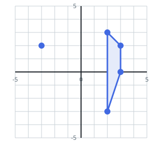

# Count Number of Trapezoids II

## Description

You are given a 2D integer array points where points[i] = [xi, yi]
represents the coordinates of the ith point on the Cartesian plane.

Return the number of unique trapezoids that can be formed by choosing any
four distinct points from points.

A trapezoid is a convex quadrilateral with at least one pair of parallel
sides. Two lines are parallel if and only if they have the same slope.

### Example 1




```text
Input: points = [[-3,2],[3,0],[2,3],[3,2],[2,-3]]
Output: 2
Explanation:
There are two distinct ways to pick four points that form a trapezoid:

- The points [-3,2], [2,3], [3,2], [2,-3] form one trapezoid.
- The points [2,3], [3,2], [3,0], [2,-3] form another trapezoid.
```

### Example 2


```text
Input: points = [[0,0],[1,0],[0,1],[2,1]]
Output: 1
Explanation:
There is only one trapezoid which can be formed.
```

### Constraints

- `4 <= points.length <= 500`
- `-1000 <= xi, yi <= 1000`
- All points are pairwise distinct.

## Hints

### Hint 1

Hash every point-pair by its reduced slope (dy,dx) (normalize with GCD and fix signs).

### Hint 2

In each slope-bucket of size k, there are C(k,2) ways to pick two segments as the trapezoid's parallel bases.

### Hint 3

Skip any base-pair that shares an endpoint since it would not form a quadrilateral.

### Hint 4

Subtract one count for each parallelogram. Each parallelogram was counted once for each of its two parallel-side pairs, so after subtracting once, every quadrilateral with at least one pair of parallel sides, including parallelograms, contributes exactly one to the final total.

### Hint 5

Final answer = total valid base-pairs minus parallelogram overcounts.
