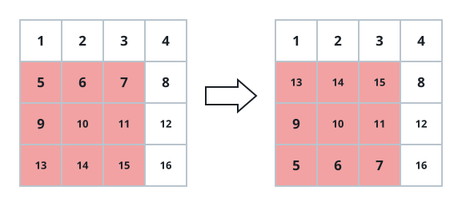
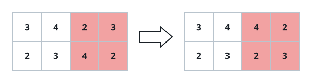

# Flip Square Submatrix Vertically

## Description

You are given an m x n integer matrix grid and three integers x, y, and k.

The integers x and y are the row and column indices of the top-left corner
of a square submatrix of grid, and k is the side length of that square.
Flip the submatrix vertically by reversing the order of its rows; every
cell outside the square keeps its value.

Return the updated matrix.

### Example 1



```text
Input: grid = [[1,2,3,4],[5,6,7,8],[9,10,11,12],[13,14,15,16]], x = 1, y = 0, k = 3
Output: [[1,2,3,4],[13,14,15,8],[9,10,11,12],[5,6,7,16]]
Explanation: The flipped square spans rows 1 through 3 and columns 0
through 2. Its outer rows trade places - [5,6,7] moves to the bottom of
the square while [13,14,15] moves to the top - and its middle row
[9,10,11] stays where it is. Cells outside the square are untouched.
```

### Example 2



```text
Input: grid = [[3,4,2,3],[2,3,4,2]], x = 0, y = 2, k = 2
Output: [[3,4,4,2],[2,3,2,3]]
Explanation: The grid itself is not square, but the selected 2 x 2 region
in columns 2 through 3 is, and its two rows are exchanged.
```

### Constraints

- `m == grid.length`
- `n == grid[i].length`
- `1 <= m, n <= 50`
- `1 <= grid[i][j] <= 100`
- `0 <= x < m`
- `0 <= y < n`
- `1 <= k <= min(m - x, n - y)`

## Hints

### Hint 1

Walk two pointers inward from the square's top and bottom rows, exchanging
their k column entries pairwise until the pointers meet.
