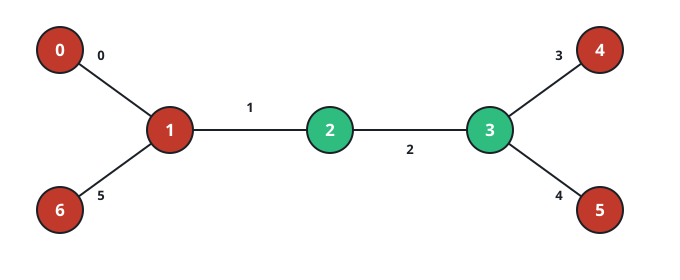
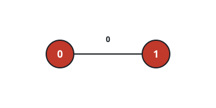

# Minimum Edge Toggles on a Tree

## Description

You are given an undirected tree with `n` nodes, numbered from `0` to `n - 1`.
It is represented by a 2D integer array `edges` of length `n - 1`, where
`edges[i] = [ai, bi]` indicates that there is an edge between nodes `ai` and
`bi` in the tree.

You are also given two binary strings `start` and `target` of length `n`. For
each node `x`, `start[x]` is its initial color and `target[x]` is its desired
color.

In one operation, you may pick an edge with index `i` and toggle both of its
endpoints. That is, if the edge is `[u, v]`, then the colors of nodes `u` and
`v` each flip from `'0'` to `'1'` or from `'1'` to `'0'`.

Return an array of edge indices whose operations transform `start` into
`target`. Among all valid sequences with minimum possible length, return the
edge indices in increasing order.

If it is impossible to transform `start` into `target`, return an array
containing a single element equal to `-1`.

### Example 1


```text
Input: n = 3, edges = [[0,1],[1,2]], start = "010", target = "100"
Output: [0]
Explanation: Toggle edge with index 0, which flips nodes 0 and 1. The string
changes from "010" to "100", matching the target.
```

### Example 2



```text
Input: n = 7, edges = [[0,1],[1,2],[2,3],[3,4],[3,5],[1,6]], start = "0011000", target = "0010001"
Output: [1,2,5]
Explanation:
Toggle edge with index 1, which flips nodes 1 and 2.
Toggle edge with index 2, which flips nodes 2 and 3.
Toggle edge with index 5, which flips nodes 1 and 6.

After these operations, the resulting string becomes "0010001", which matches
the target.
```

### Example 3



```text
Input: n = 2, edges = [[0,1]], start = "00", target = "01"
Output: [-1]
Explanation: There is no sequence of edge toggles that transforms "00" into
"01". Therefore, we return [-1].
```

### Constraints

- `2 <= n == start.length == target.length <= 10⁵`
- `edges.length == n - 1`
- `edges[i] = [ai, bi]`
- `0 <= ai, bi < n`
- `start[i]` is either `'0'` or `'1'`.
- `target[i]` is either `'0'` or `'1'`.
- The input is generated such that `edges` represents a valid tree.

## Hints

### Hint 1

Use a depth-first search (DFS).

### Hint 2

Root the tree at any node. Traverse the tree, keeping track of flips applied
from the parent to the subtree.

### Hint 3

After processing a child subtree, determine whether the current node still
needs to be flipped to match the target. If a flip is needed, record the
corresponding edge.

### Hint 4

Collect all flipped edges; if the transformation is impossible, return `[-1]`.
