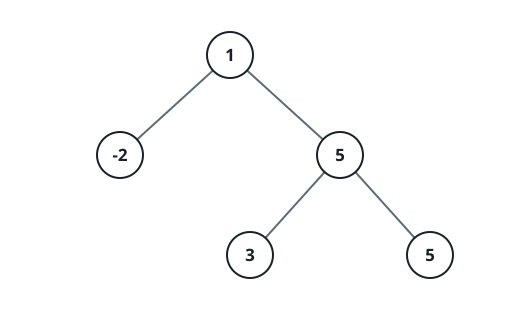
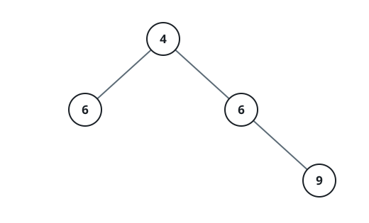

# Maximum Distinct Path Sum in a Binary Tree

## Description

You are given the root of a binary tree, where each node contains an integer
value.

A valid path in the tree is a sequence of connected nodes such that:

- The path can start and end at any node in the tree.
- The path does not need to pass through the root.
- All node values along the path are distinct.

Return an integer denoting the maximum possible sum of node values among all
valid paths.

### Example 1


```text
Input: root = [2,2,1]
Output: 3
Explanation: The path 2 → 2 is invalid because the value 2 is not distinct.
The maximum-sum valid path is 2 → 1, with a sum = 2 + 1 = 3.
```

### Example 2



```text
Input: root = [1,-2,5,null,null,3,5]
Output: 9
Explanation: The path 3 → 5 → 5 is invalid due to duplicate value 5.
The maximum-sum valid path is 1 → 5 → 3, with a sum = 1 + 5 + 3 = 9.
```

### Example 3



```text
Input: root = [4,6,6,null,null,null,9]
Output: 19
Explanation: The path 6 → 4 → 6 → 9 is invalid because the value 6 appears
more than once. The maximum-sum valid path is 4 → 6 → 9, with a sum =
4 + 6 + 9 = 19.
```

### Constraints

- The number of nodes in the tree is in the range `[1, 1000]`.
- `-1000 <= Node.val <= 1000`

## Hints

### Hint 1

Try all possible starting nodes.

### Hint 2

For a given node, the possible outgoing edges are the left child, right
child, and parent.

### Hint 3

During depth first search (DFS), only visit a node if its value has not
already been seen.

### Hint 4

Take the maximum over all possible starting nodes.
