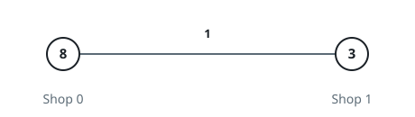
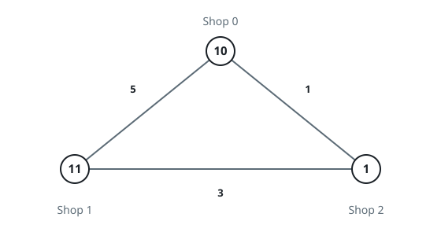

# Minimum Cost to Buy Apples II

## Description

You are given an integer `n` and an integer array `prices` of length `n`, where
`prices[i]` is the price of apples at shop `i`.

You are also given a 2D integer array `roads`, where
`roads[i] = [uᵢ, vᵢ, costᵢ, taxᵢ]` represents a bidirectional road:

- `uᵢ` and `vᵢ` are the shops connected by the road.
- `costᵢ` is the cost to travel the road without carrying apples.
- `taxᵢ` is the multiplier applied to `costᵢ` when traveling with apples.

For each shop `i`, you can either:

- Buy apples locally at shop `i` for `prices[i]`.
- Travel empty to any shop `j` using any number of roads, buy apples for
  `prices[j]`, and return to shop `i` while carrying apples, paying
  `cost * tax` on each road used for the return trip.

The forward path, where you travel empty, and the return path may be different.

Return an integer array `ans` of length `n`, where `ans[i]` is the minimum
total cost to buy apples starting from shop `i`.

### Example 1



```text
Input: n = 2, prices = [8,3], roads = [[0,1,1,2]]
Output: [6,3]
```

### Example 2


```text
Input: n = 3, prices = [9,4,6], roads = [[0,1,1,3],[1,2,4,2]]
Output: [8,4,6]
```

### Example 3



```text
Input: n = 3, prices = [10,11,1], roads = [[0,2,1,3],[1,2,3,4],[0,1,5,2]]
Output: [5,11,1]
```

### Constraints

- `1 <= n <= 1000`
- `prices.length == n`
- `1 <= prices[i] <= 10⁹`
- `0 <= roads.length <= min(n * (n - 1) / 2, 2000)`
- `roads[i] = [uᵢ, vᵢ, costᵢ, taxᵢ]`
- `0 <= uᵢ, vᵢ <= n - 1`
- `uᵢ != vᵢ`
- `1 <= costᵢ <= 10⁹`
- `1 <= taxᵢ <= 100`
- There are no repeated edges.
